# Índice de contenidos

**Antes de leer**

- [Qué son Source, PDF y Concepto](#qué-son-source-pdf-y-concepto) — p. 4
- [¿Desde dónde comienzo?](#desde-dónde-comienzo) — p. 5
- [Mapa de decisión](#mapa-de-decisión) — p. 6
- [Caso 1 — Comenzar desde cero](#caso-1--comenzar-desde-cero) — p. 7
- [Caso 2 — Ya tengo el documento, pero todavía no tengo conceptos](#caso-2--ya-tengo-el-documento-pero-todavía-no-tengo-conceptos) — p. 12
- [Caso 3 — Ya tengo conceptos, pero todavía no tengo el PDF](#caso-3--ya-tengo-conceptos-pero-todavía-no-tengo-el-pdf) — p. 16
- [Comparación rápida](#comparación-rápida) — p. 20
- [Qué escribe la persona y qué completa MathMongo](#qué-escribe-la-persona-y-qué-completa-mathmongo-al-comenzar) — p. 21
- [Errores frecuentes según el punto de partida](#errores-frecuentes-según-el-punto-de-partida) — p. 22

**Guía de lectura**

1. [Cómo iniciar MathMongo](#1-cómo-iniciar-mathmongo) — p. 23
2. [Qué servicios inicia `make run`](#2-qué-servicios-inicia-make-run) — p. 24
3. [Biblioteca](#3-biblioteca) — p. 25
4. [Leer](#4-leer) — p. 27
5. [Abrir el lector avanzado](#5-abrir-el-lector-avanzado) — p. 28
6. [Navegación del PDF](#6-navegación-del-pdf) — p. 29
7. [Miniaturas](#7-miniaturas) — p. 30
8. [Zoom, ajuste, rotación y búsqueda](#8-zoom-ajuste-rotación-y-búsqueda) — p. 32
9. [Seleccionar texto](#9-seleccionar-texto) — p. 33
10. [Crear un Highlight](#10-crear-un-highlight) — p. 34
11. [Crear un Underline](#11-crear-un-underline) — p. 36
12. [Selección temporal frente a marca guardada](#12-selección-temporal-frente-a-marca-guardada) — p. 37
13. [Asociar una marca con un concepto](#13-asociar-una-marca-con-un-concepto) — p. 38
14. [Buscar y seleccionar un concepto](#14-buscar-y-seleccionar-un-concepto) — p. 39
15. [Guardar una asociación](#15-guardar-una-asociación) — p. 41
16. [Revisar conceptos vinculados](#16-revisar-conceptos-vinculados) — p. 42
17. [Nota rápida](#17-nota-rápida) — p. 44
18. [Cuaderno](#18-cuaderno) — p. 45
19. [Conocimiento](#19-conocimiento) — p. 48
20. [Configuración](#20-configuración) — p. 50
21. [Page Map](#21-page-map) — p. 51
22. [Maintenance](#22-maintenance) — p. 52
23. [Cerrar MathMongo correctamente](#23-cerrar-mathmongo-correctamente) — p. 54
24. [Solución de problemas](#24-solución-de-problemas) — p. 55

# Cómo usar esta guía

Esta guía enseña el flujo actual de MathMongo sin exigir conocimientos de
MongoDB, Streamlit o PDF.js. Las capturas proceden de la aplicación real y de
bibliotecas temporales de demostración. Los recuadros rojos numerados señalan
los controles que intervienen en cada procedimiento.

La idea central es siempre la misma:

> **Elegir un documento → leer → seleccionar → guardar una marca → asociar un
> concepto o escribir una nota → continuar leyendo.**

Los datos, títulos y documentos mostrados son sintéticos. No se utilizaron
documentos personales ni se modificó `MathV0`.

# Qué son Source, PDF y Concepto

Antes de elegir una ruta conviene separar tres cosas que cumplen funciones
distintas:

- **Source** representa la obra o fuente general: un libro, artículo, curso,
  proyecto o conjunto de materiales.
- **PDF** es un **Document** asociado a una Source. Una Source puede no tener
  PDF, tener uno o tener varios.
- **Concepto** es conocimiento matemático registrado en MathMongo. Puede
  existir antes de que haya un PDF.

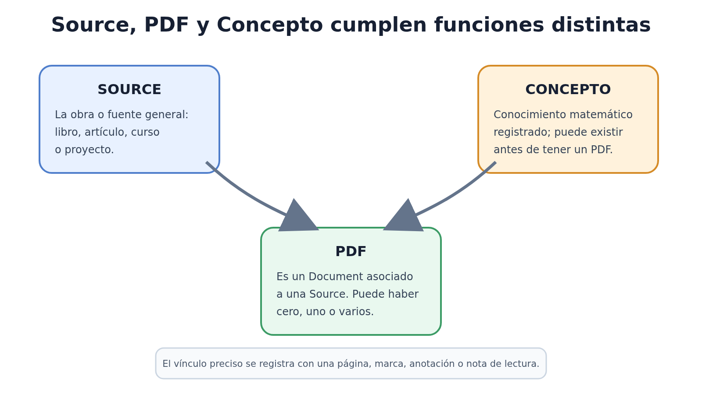{.guide-shot}

Los conceptos pueden estar relacionados con una Source o con su contenido,
pero el vínculo documental preciso se registra mediante una página, una
marca, una anotación o una nota de lectura:

> **Concepto ↔ marca, anotación, nota o página ↔ PDF ↔ Source.**

Por eso no es necesario crear un concepto al cargar el documento ni cargar un
PDF al crear un concepto. La asociación se puede completar cuando aparece la
evidencia durante la lectura.

# ¿DESDE DÓNDE COMIENZO?

## ¿Qué tienes registrado actualmente?

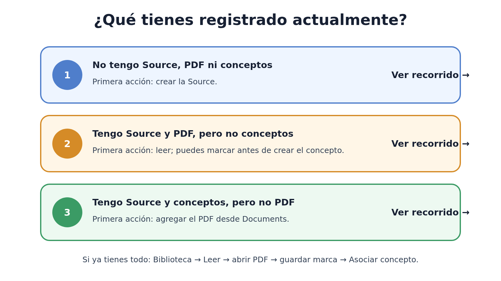{.guide-shot}

- **Ruta 1 — No tengo Source, PDF ni conceptos.** Crea primero la Source; luego
  agrega el PDF y el concepto que necesites.
- **Ruta 2 — Tengo Source y PDF, pero no conceptos.** Puedes empezar a leer y
  marcar; el concepto puede crearse después.
- **Ruta 3 — Tengo Source y conceptos, pero no PDF.** Agrega el PDF a la Source
  existente; no vuelvas a crear los conceptos.

Si ya existen Source, PDF y conceptos, la ruta corta es:

> **Biblioteca → Leer → abrir PDF → guardar marca → Asociar concepto → continuar leyendo.**

# Mapa de decisión

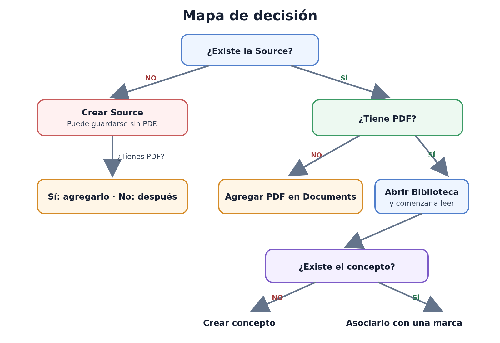{.guide-shot}

La Source puede guardarse sin documento. Si ya existe, entra en **Edit /
Analyze Source → Documents** para comprobar o agregar sus PDF. Cuando haya un
PDF, **Biblioteca** es el punto de entrada a la lectura. El concepto puede
existir antes o crearse después de guardar la marca.

# CASO 1 — COMENZAR DESDE CERO

**Estado inicial.** No hay Sources, References, Documents ni Concepts.

**Objetivo.** Crear la Source, agregar el PDF, crear un concepto, abrir el PDF,
guardar una marca y asociar el concepto.

### En este caso

> **TÚ ESCRIBES:** nombre de Source, dato bibliográfico opcional, PDF y
> contenido del concepto. **MATHMONGO COMPLETA:** identidades, vínculo
> Source–Document, propiedades del archivo, página, geometría y fechas.

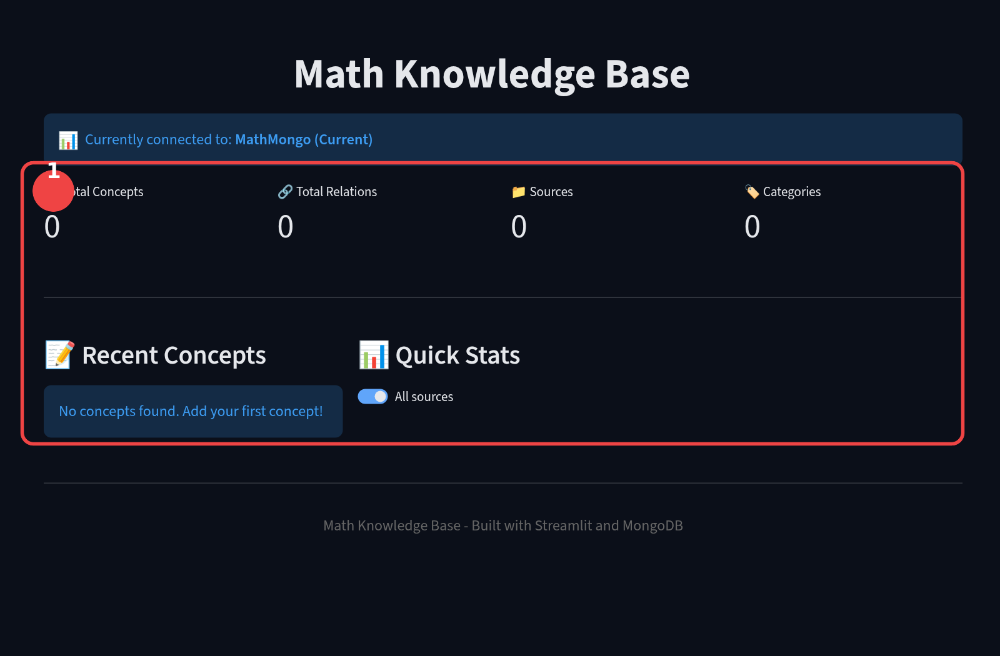{.guide-shot}

## Paso 1 — Crear la Source

1. Abre MathMongo y entra en **Add Source**.
2. Escribe un nombre visible.
3. Revisa la vista previa, confirma la escritura y guarda.

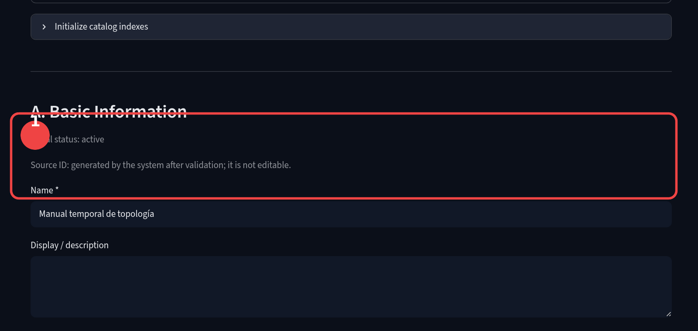{.guide-shot}

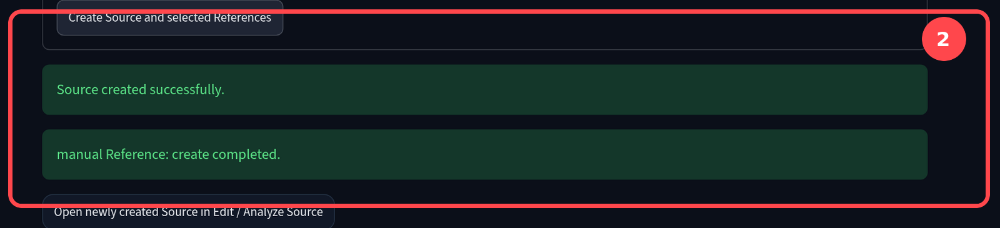{.guide-shot}

### Source — mínimo para comenzar

| Necesario ahora | Puede completarse después |
|---|---|
| Nombre visible de la Source | Tipo, descripción, autores, tags, URL, notas y datos bibliográficos adicionales |

La **Reference es opcional** al crear la Source. Úsala cuando quieras describir
la edición, artículo o ficha bibliográfica concreta. Si eliges crear una
Reference manual, la interfaz exige al menos un dato identificador: por
ejemplo título, autores, DOI, ISBN, URL o clave BibTeX. Para el recorrido
temporal bastó un título.

## Paso 2 — Agregar el PDF

1. En **Edit / Analyze Source**, elige la Source recién creada.
2. Abre **Documents → ADD PDF**.
3. Selecciona el archivo PDF.
4. El título y la Reference asociada son opcionales; un título legible ayuda a
   reconocer la tarjeta en Biblioteca.
5. Confirma la escritura y guarda. MathMongo valida automáticamente el archivo
   y lo enlaza con la Source seleccionada.

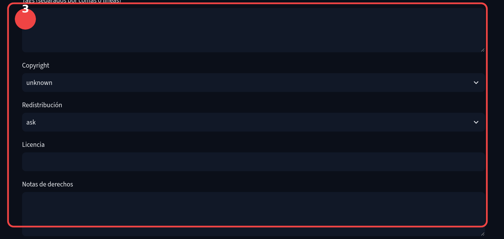{.guide-shot}

### PDF — mínimo para comenzar

| Necesario ahora | Puede completarse después |
|---|---|
| Archivo PDF y confirmación de escritura | Título documental y Reference asociada |

No escribas identificadores, huellas, tamaño, tipo de archivo ni la relación
Source–Document: MathMongo los obtiene del archivo y del contexto.

## Paso 3 — Crear el concepto

1. Abre **Add Concept**.
2. Escribe un identificador breve, elige la Source y redacta la definición o
   contenido en **LaTeX Content**.
3. Confirma y guarda. El título descriptivo y los campos avanzados pueden
   completarse después.

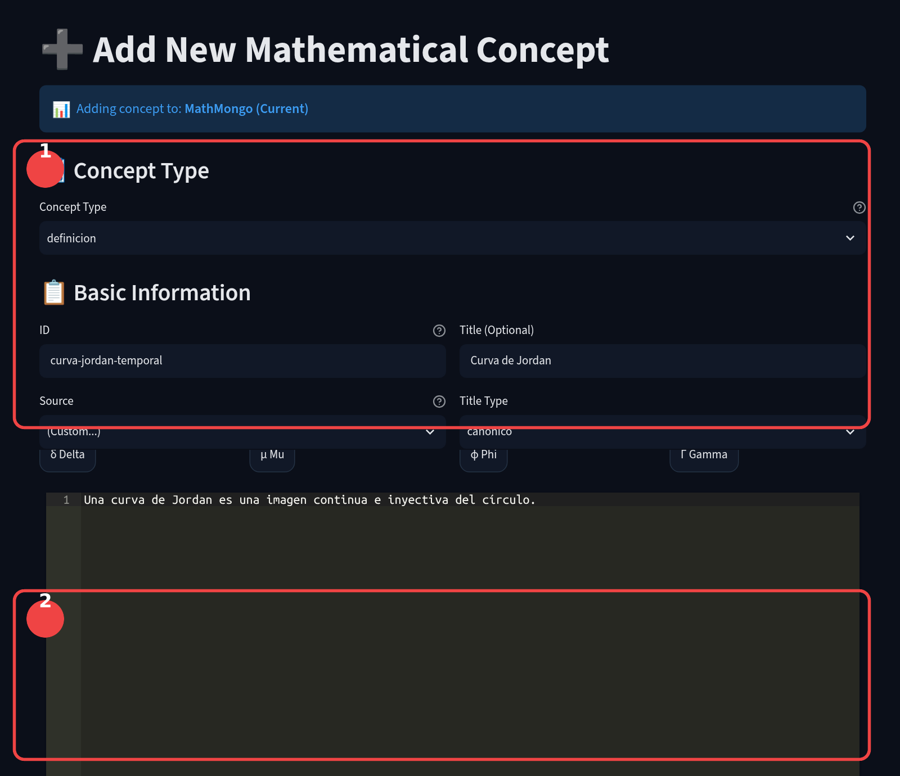{.guide-shot}

### Concepto — mínimo para comenzar

| Necesario ahora | Puede completarse después |
|---|---|
| ID visible, Source y LaTeX Content | Título descriptivo, tipo, relaciones y metadatos avanzados |

En este formulario **LaTeX Content** es el cuerpo matemático del concepto; no
es necesario usar comandos LaTeX si la definición es texto sencillo.

## Paso 4 — Leer, marcar y asociar

1. Abre **Reading Space → Biblioteca** y pulsa **Leer** en la tarjeta.
2. En **Leer**, pulsa **Abrir lector avanzado**.
3. Arrastra sobre un fragmento seleccionable del PDF.
4. Elige **Highlight** y pulsa **Guardar marca**.
5. Pulsa **Asociar concepto**, busca el concepto creado, selecciónalo y guarda
   la asociación.

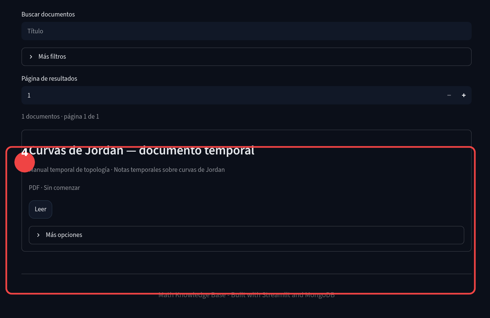{.guide-shot}

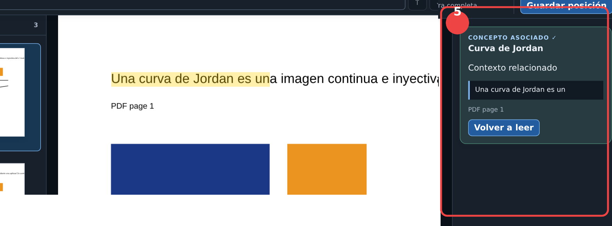{.guide-shot}

**Resultado esperado.** El inspector muestra **CONCEPTO ASOCIADO ✓** y el PDF
permanece visible.

> **Source creada → PDF asociado → Concepto creado → Marca guardada → Concepto asociado.**

# CASO 2 — YA TENGO EL DOCUMENTO, PERO TODAVÍA NO TENGO CONCEPTOS

**Estado inicial.** Hay una Source y un PDF asociado; no hay conceptos.

**Objetivo.** Descubrir una idea, guardar la marca, crear el concepto, volver a
la marca y asociarlo.

### En este caso

> **TÚ ESCRIBES:** selección, contenido del concepto y búsqueda para
> localizarlo. **MATHMONGO COMPLETA:** página, geometría, anotación, procedencia,
> identidad interna y fechas.

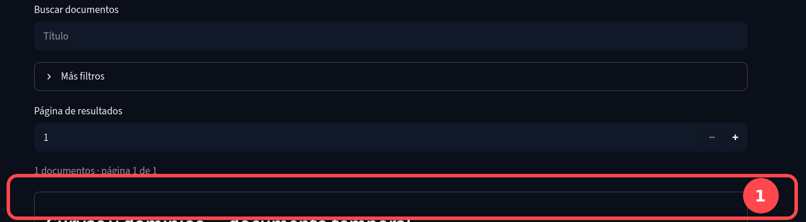{.guide-shot}

## Camino A — Crear primero el concepto

1. Abre **Add Concept** y crea el concepto con ID, Source y LaTeX Content.
2. Ve a **Reading Space → Biblioteca** y pulsa **Leer**.
3. Abre el lector avanzado, selecciona texto y guarda un Highlight.
4. Pulsa **Asociar concepto**, busca el concepto y guarda el vínculo.

Este camino sirve cuando ya sabes qué concepto quieres documentar.

## Camino B — Marcar primero y crear el concepto después (recomendado)

Es normal descubrir primero una idea durante la lectura y crear el concepto
después.

1. En **Biblioteca**, abre el PDF con **Leer** y luego **Abrir lector avanzado**.
2. Selecciona el fragmento y guarda un **Highlight**. La marca se conserva
   aunque aún no tenga concepto.
3. Regresa a Reading Space y abre **Conocimiento** para localizar **Pendientes
   de vincular**. También puedes revisar la marca desde **Cuaderno**.
4. Abre **Add Concept**, crea el concepto mínimo y guarda.
5. Vuelve a **Cuaderno**, localiza la marca y pulsa **Ir a la marca**. Desde
   **Leer**, abre otra vez el lector avanzado y entra en **Revisar marcas**.
6. En la tarjeta de la marca pulsa **Asociar concepto**, busca el concepto
   recién creado, selecciónalo y guarda.

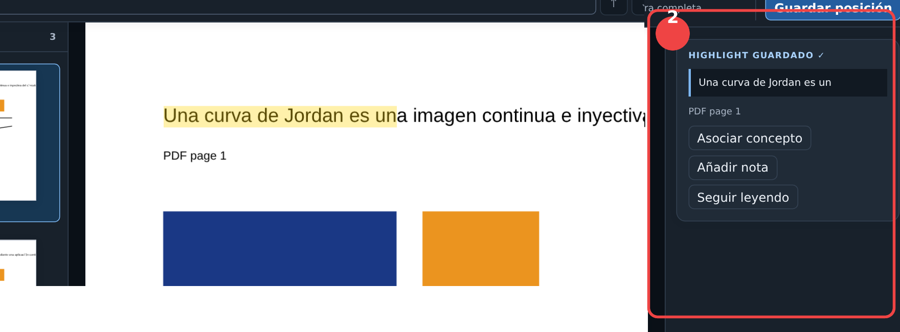{.guide-shot}

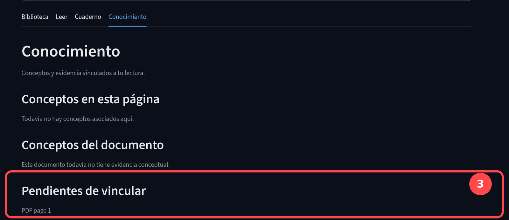{.guide-shot}

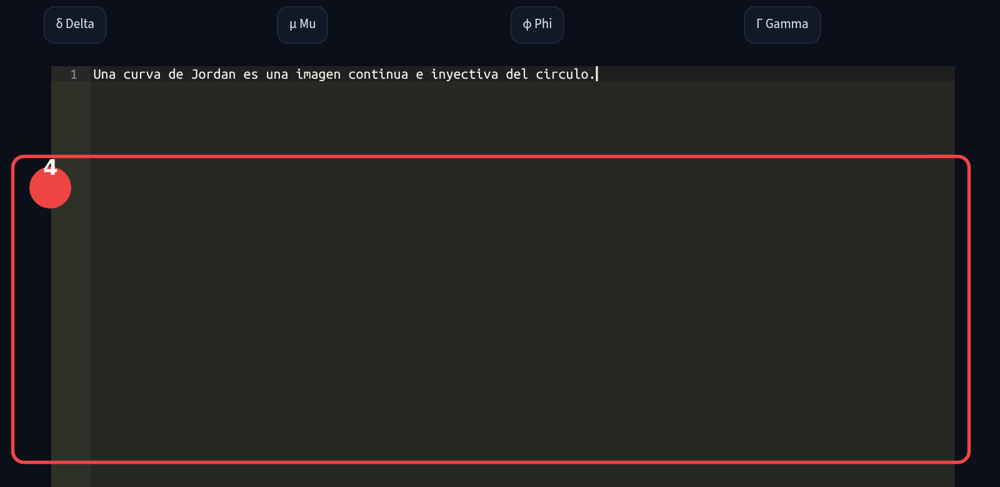{.guide-shot}

{.guide-shot}

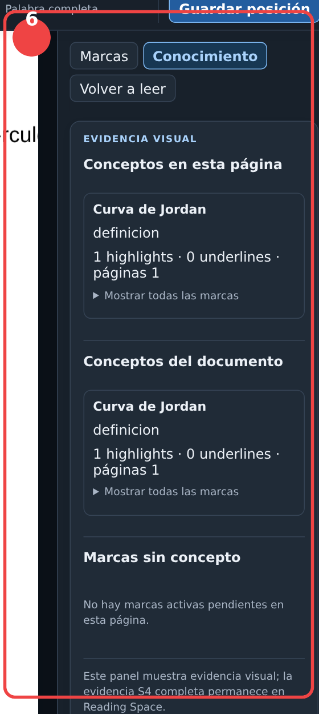{.guide-shot .portrait-shot}

**Resultado esperado.** La marca deja de ser pendiente, el inspector confirma
la asociación y **Conocimiento** muestra el concepto en la página o documento.
El PDF continúa visible mientras se completa la asociación en Advanced Reader.

# CASO 3 — YA TENGO CONCEPTOS, PERO TODAVÍA NO TENGO EL PDF

**Estado inicial.** Hay una Source y conceptos relevantes, pero no hay PDF
asociado a esa Source.

**Objetivo.** Agregar el PDF, abrirlo, buscar evidencia de un concepto
existente, marcarla y asociarla.

### En este caso

> **TÚ ESCRIBES:** PDF, título opcional, búsqueda y concepto existente.
> **MATHMONGO COMPLETA:** integridad documental, relación con la Source, página,
> anotación, geometría y fechas.

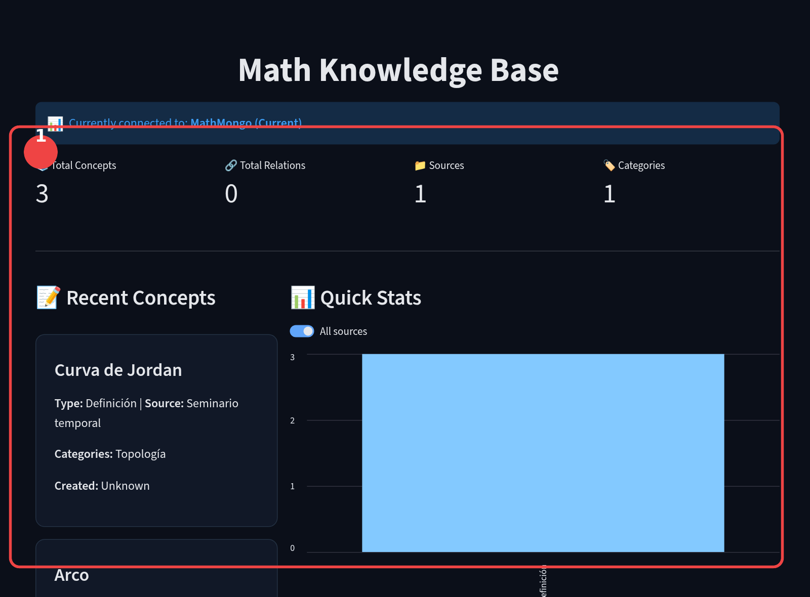{.guide-shot}

## Paso 1 — Comprobar Documents y agregar el PDF

1. Abre **Edit / Analyze Source** y selecciona la Source correcta.
2. Entra en **Documents**. La lista vacía confirma que aún no hay PDF.
3. Pulsa **ADD PDF**, selecciona el archivo, añade un título legible si lo
   deseas, confirma y guarda.
4. La interfaz valida integridad, tamaño y tipo automáticamente. No copies ni
   escribas los metadatos técnicos.

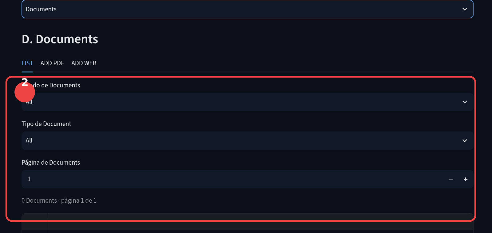{.guide-shot}

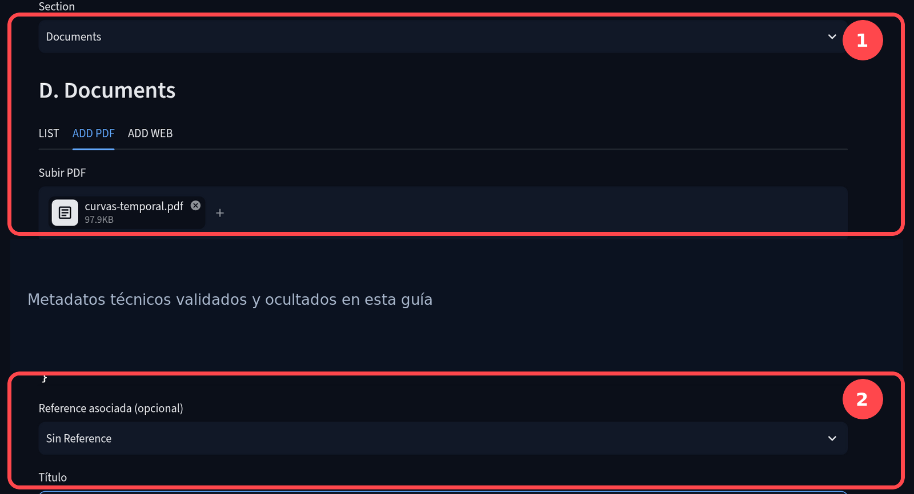{.guide-shot}

## Paso 2 — Buscar evidencia y asociar un concepto existente

1. Abre **Biblioteca**, comprueba que apareció el PDF y pulsa **Leer**.
2. Abre el lector avanzado.
3. Usa **Buscar** o navega hasta una definición relacionada con uno de los
   conceptos existentes.
4. Selecciona el fragmento y guarda **Highlight** o **Underline**.
5. Pulsa **Asociar concepto**, busca el concepto ya existente y guarda.

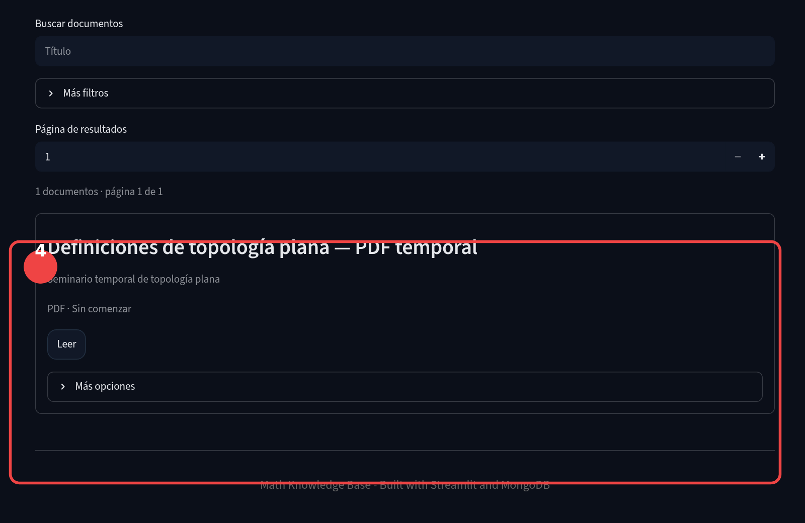{.guide-shot}

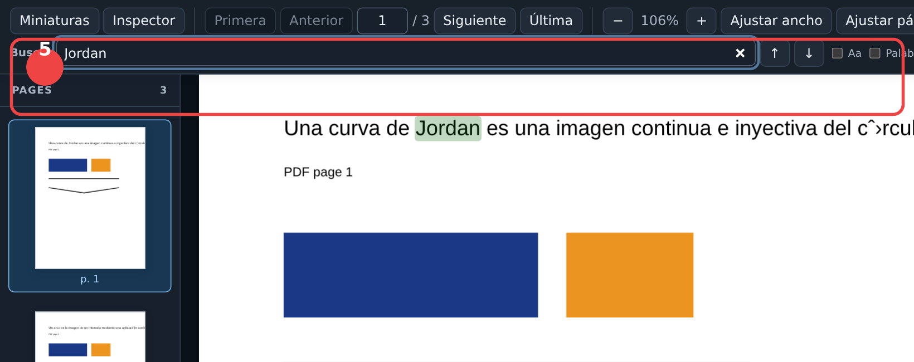{.guide-shot}

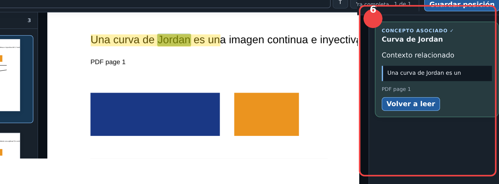{.guide-shot}

**Resultado esperado.** El concepto elegido queda asociado a la marca y a su
página. No se creó un duplicado y el PDF sigue visible.

# Comparación rápida

| Lo que ya existe | Lo que falta | Primera acción | Dónde hacerlo |
|---|---|---|---|
| Nada | Source, PDF y conceptos | Crear Source | Add Source |
| Source + PDF | Conceptos | Leer y crear concepto | Biblioteca; Add Concept |
| Source + conceptos | PDF | Agregar PDF | Edit / Analyze Source → Documents |
| Source + PDF + conceptos | Evidencia | Leer, marcar y asociar | Biblioteca; Advanced Reader |
| Marca sin concepto | Vínculo | Crear o buscar concepto | Add Concept; Cuaderno; Conocimiento |
| Concepto sin evidencia | Evidencia documental | Buscarlo en los PDF | Advanced Reader |

**Regla breve.** No recrees lo que ya existe. Agrega solamente la pieza que
falta y usa la marca para registrar el vínculo documental preciso.

# Qué escribe la persona y qué completa MathMongo al comenzar

| Tú escribes o eliges | MathMongo completa automáticamente |
|---|---|
| Nombre visible de la Source | Identidades internas y fechas |
| Dato bibliográfico, sólo si creas una Reference | Relación entre Source y Document |
| PDF que quieres asociar | Tamaño, tipo e integridad del archivo |
| Contenido del concepto | Identidad interna del concepto |
| Texto de una nota | Página y contexto de lectura |
| Fragmento seleccionado y búsqueda del concepto | Posición, geometría, anotación y vínculo documental |

En la explicación cotidiana no necesitas nombres de colecciones, URI de base,
rutas de archivos, hashes ni IDs técnicos.

# Errores frecuentes según el punto de partida

| Caso | Qué ocurrió | Cómo reconocerlo | Cómo corregirlo |
|---|---|---|---|
| 1 | Se intenta agregar un PDF antes de crear la Source | No hay Source que seleccionar en Edit / Analyze Source | Crea primero la Source con su nombre visible |
| 1 | Se tratan todos los campos como obligatorios | El formulario parece más largo de lo necesario | Completa sólo los campos de la tabla “Necesario ahora” |
| 1 | Se cree que el concepto necesita PDF desde el inicio | Se pospone innecesariamente Add Concept | Guarda el concepto; la evidencia se vincula al leer |
| 2 | Se cree que una marca no puede guardarse sin concepto | La persona abandona una selección útil | Guarda la marca y revísala en Pendientes de vincular |
| 2 | Se recrea la Source o el PDF | Aparecen tarjetas duplicadas | Vuelve a Biblioteca y usa el documento existente |
| 2 | No se encuentra la marca pendiente | Conocimiento aún dice que no hay conceptos asociados | Baja a Pendientes de vincular o búscala en Cuaderno |
| 3 | Se recrean conceptos existentes | La búsqueda devuelve nombres duplicados | Cancela y selecciona el concepto ya registrado |
| 3 | El PDF se agrega a otra Source | No aparece con la obra esperada en Biblioteca | Revisa la Source seleccionada antes de confirmar ADD PDF |
| 3 | Se confunden Source y Reference | Se intenta usar una ficha bibliográfica como obra general | Source es la obra; Reference describe una edición o referencia concreta |
| 3 | No se verifica el documento | La tarjeta o el lector no muestran el archivo esperado | Comprueba el título y la validación antes de abrir Biblioteca |

Las capturas de los recorridos muestran los puntos de reconocimiento útiles;
los errores que no requieren una pantalla distinta se corrigen con la misma
ruta, sin introducir datos técnicos.

# 1. Cómo iniciar MathMongo

**Objetivo.** Abrir la aplicación completa desde el entorno del proyecto.

**Dónde está.** En una terminal, dentro del repositorio de MathMongo.

```bash
cd /ruta/al/repositorio/math-knowledge-base
source mathdbmongo/bin/activate
make run
```

Después abre `http://127.0.0.1:8501` en una ventana limpia del navegador.

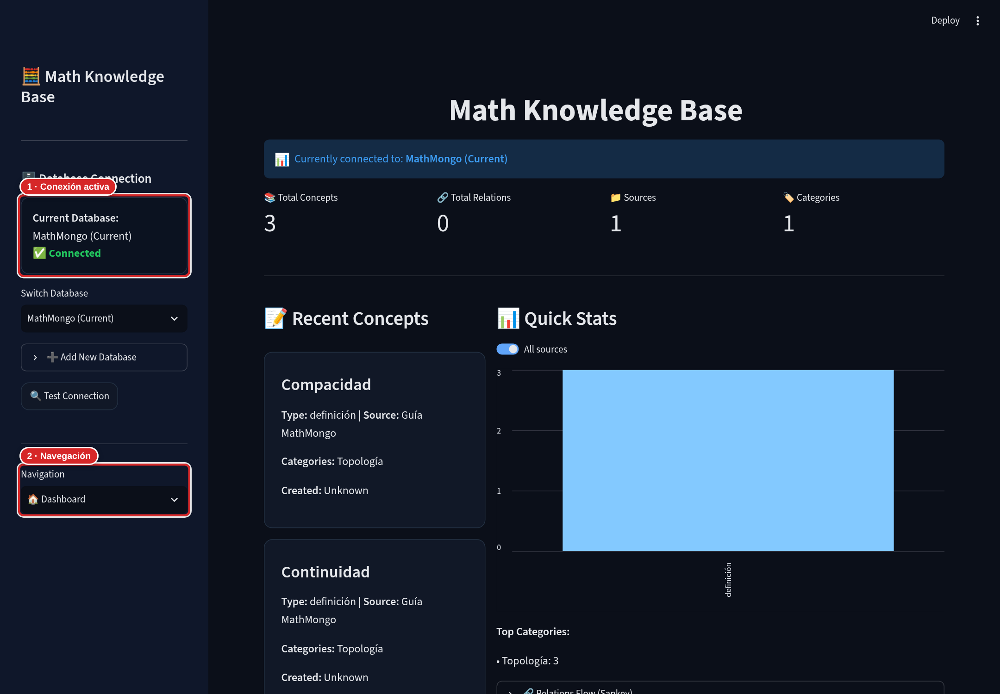{.guide-shot}

1. Comprueba que la conexión activa aparece como conectada.
2. Usa **Navigation** para entrar en **Reading Space**.
3. No cierres la terminal: mantiene los servicios activos.

**Resultado esperado.** Aparece la pantalla principal sin trazas de error y la
navegación responde.

**Error frecuente.** Ejecutar `make run` fuera del repositorio o sin activar el
entorno. Vuelve al directorio indicado y repite los tres comandos.

**Volver al flujo de lectura.** En **Navigation**, elige **Reading Space**.

# 2. Qué servicios inicia `make run`

**Objetivo.** Entender qué debe estar disponible sin convertir la arquitectura
en una tarea cotidiana.

`make run` coordina dos interfaces locales:

| Servicio | Dirección normal | Para qué se usa |
|---|---|---|
| MathMongo / Streamlit | `http://127.0.0.1:8501` | Biblioteca, Leer, Cuaderno, Conocimiento y Configuración |
| Advanced Reader | `http://127.0.0.1:8766` | PDF, búsqueda, miniaturas, marcas visuales y asociaciones |

MongoDB debe estar disponible antes de iniciar. `make run` no convierte la base
en un servicio remoto ni abre las interfaces fuera del equipo.

**Resultado esperado.** La terminal informa que ambos servicios están listos.

**Error frecuente.** Abrir directamente el puerto 8766 sin un documento. El
lector avanzado necesita que primero selecciones un PDF desde Biblioteca.

**Volver al flujo de lectura.** Abre el puerto 8501 y entra en Reading Space.

# 3. Biblioteca

**Objetivo.** Encontrar un PDF o recurso web y empezar o continuar una lectura.

**Dónde está.** Reading Space → **Biblioteca**. Sin documento seleccionado es la
entrada inicial.

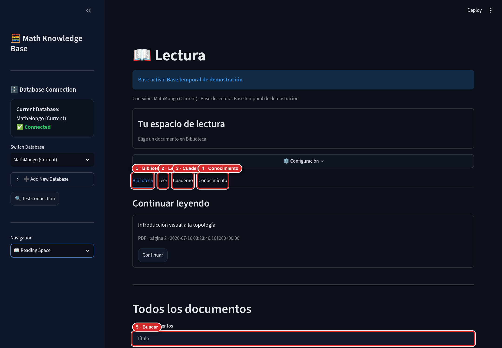{.guide-shot}

1. **Biblioteca** reúne documentos y lecturas recientes.
2. **Leer** abre el documento activo.
3. **Cuaderno** revisa marcas y notas.
4. **Conocimiento** revisa conceptos y evidencia.
5. Escribe parte del título en **Buscar documentos**.

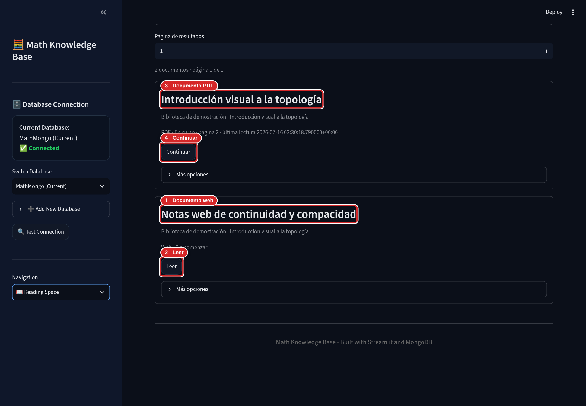{.guide-shot}

- Pulsa **Leer** si el documento todavía no tiene progreso.
- Pulsa **Continuar** si MathMongo ya conoce su última página.
- Abre **Más opciones** sólo si necesitas acciones secundarias del documento.

**Resultado esperado.** El documento queda seleccionado y MathMongo cambia a
Leer conservando la selección al volver a Biblioteca.

**Error frecuente.** Buscar por un ID o una ruta. La búsqueda normal está
pensada para títulos legibles.

**Volver al flujo de lectura.** Si estás en otra vista, pulsa Biblioteca y luego
Leer/Continuar en la tarjeta apropiada.

# 4. Leer

**Objetivo.** Controlar el documento actual, su página y las capturas rápidas.

**Dónde está.** Reading Space → **Leer**.

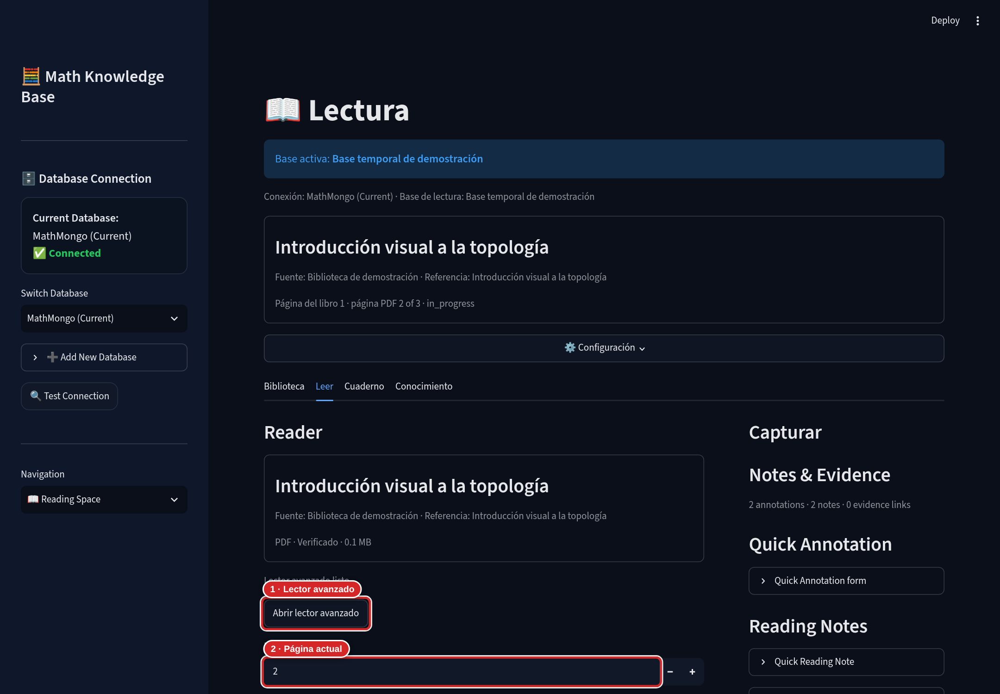{.guide-shot}

1. **Abrir lector avanzado** lleva al visor PDF.js.
2. **Página PDF** indica o cambia la página lógica actual.
3. **Guardar página** conserva la posición para Continuar leyendo.
4. **Nota rápida** abre una captura de texto breve.
5. **Más opciones** contiene Completado, Posponer y reinicio de progreso.

También están disponibles **Anterior**, **Siguiente**, **Marca rápida** y el
visor integrado alternativo. En un documento web se muestran sus metadatos y
URL; no se intenta abrir PDF.js.

**Resultado esperado.** El título, la fuente, la página y el progreso coinciden
con la tarjeta elegida.

**Error frecuente.** Entrar en Leer sin selección. MathMongo mostrará “Elige un
documento en Biblioteca”; sigue ese enlace mental y selecciona una tarjeta.

**Volver al flujo de lectura.** Pulsa Leer; no es necesario seleccionar de nuevo
el documento mientras permanezca activo.

# 5. Abrir el lector avanzado

**Objetivo.** Abrir el PDF real sin perder el documento o la página actuales.

1. En Leer, verifica la página mostrada.
2. Pulsa **Abrir lector avanzado**.
3. Espera a que aparezcan toolbar, miniaturas, PDF e inspector.

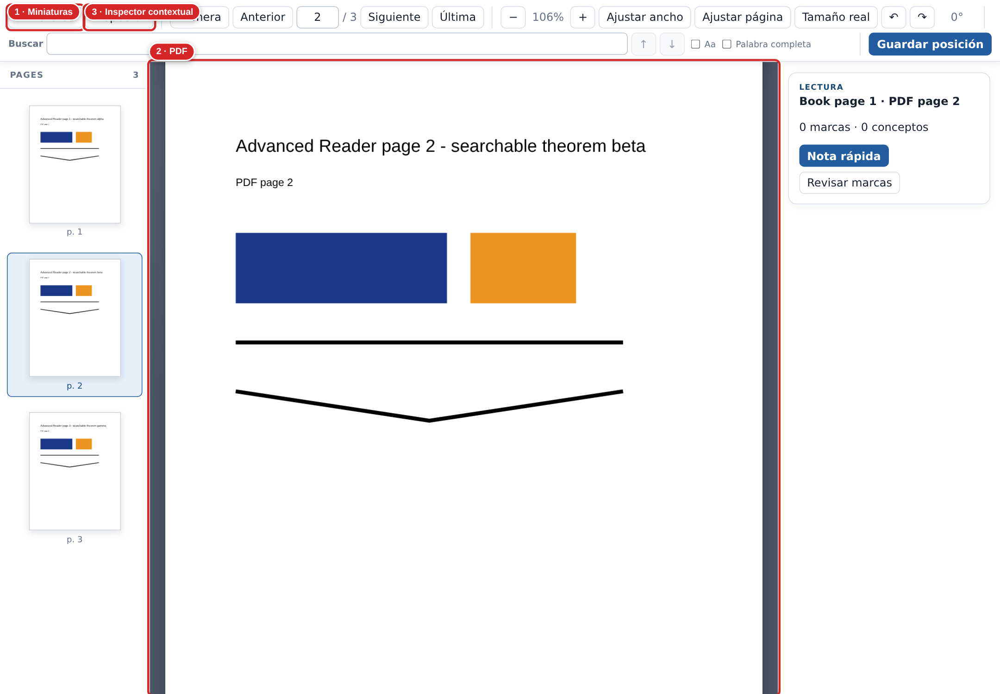{.guide-shot}

El PDF ocupa el espacio principal. Las miniaturas están a la izquierda y el
inspector contextual a la derecha. El inspector cambia de contenido según la
acción actual; el PDF no se desmonta al seleccionar o guardar.

**Resultado esperado.** La página se renderiza y el contador coincide con Leer.

**Error frecuente.** Abrir el lector de un documento web. Advanced Reader se
ofrece únicamente para documentos PDF.

**Volver al flujo de lectura.** Cierra la pestaña del lector avanzado; Reading
Space permanece abierto en la pestaña anterior.

# 6. Navegación del PDF

**Objetivo.** Moverse de forma precisa entre páginas.

**Dónde está.** Toolbar superior de Advanced Reader.

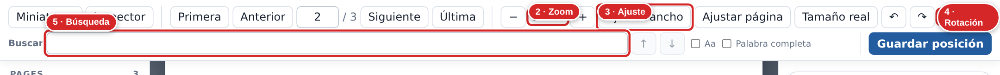{.guide-shot}

1. **Primera** y **Última** saltan a los extremos.
2. **Anterior** y **Siguiente** avanzan una página.
3. El campo de página permite escribir un número y pulsar Enter.
4. **Guardar posición** persiste la página actual.

**Resultado esperado.** El campo de página, la miniatura activa y el PDF cambian
juntos. Guardar posición permite recuperar después esa página con Continuar.

**Error frecuente.** Cambiar de página y cerrar sin guardar posición. El visor
se mueve, pero la lectura persistente puede conservar la página anterior.

**Volver al flujo de lectura.** Pulsa **Guardar posición** y continúa en el PDF.

# 7. Miniaturas

**Objetivo.** Reconocer visualmente una página y saltar a ella.

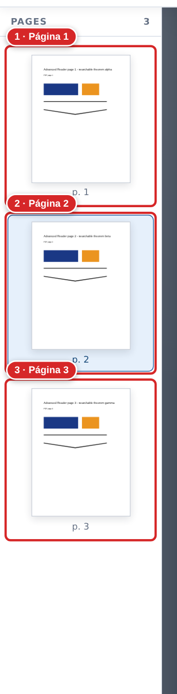{.guide-shot .portrait-shot}

1. Pulsa **Miniaturas** en la toolbar para mostrar u ocultar el panel.
2. La página activa tiene un borde destacado.
3. Pulsa una miniatura para navegar.

**Resultado esperado.** El PDF central muestra la página elegida y la miniatura
queda seleccionada.

**Error frecuente.** Confundir ocultar miniaturas con cerrar el documento. El
botón sólo libera espacio horizontal; el PDF sigue abierto.

**Volver al flujo de lectura.** Oculta el panel si quieres más espacio para el
PDF y vuelve a mostrarlo cuando necesites orientación visual.

# 8. Zoom, ajuste, rotación y búsqueda

**Objetivo.** Adaptar el PDF a la pantalla y localizar texto.

En la toolbar:

- usa **− / +** y el porcentaje para el zoom;
- usa **Ajustar ancho**, **Ajustar página** o **Tamaño real**;
- gira con los controles de rotación y consulta **Rotación actual**;
- escribe en **Buscar** y pulsa Enter para recorrer coincidencias.

La captura de la toolbar anterior señala navegación, zoom, ajuste, rotación y
búsqueda en una sola fila.

**Resultado esperado.** Zoom y rotación modifican sólo la presentación. La
búsqueda resalta coincidencias y mantiene la página visible.

**Error frecuente.** Esperar que la rotación cambie el número de página o Page
Map. Son funciones independientes.

**Volver al flujo de lectura.** Usa Ajustar ancho para recuperar una vista
cómoda y cierra la búsqueda si ya terminaste.

# 9. Seleccionar texto

**Objetivo.** Preparar un fragmento antes de crear una marca.

1. Arrastra sobre el texto del PDF.
2. Suelta el puntero.
3. Revisa el inspector: debe decir **Texto seleccionado · Sin guardar**.

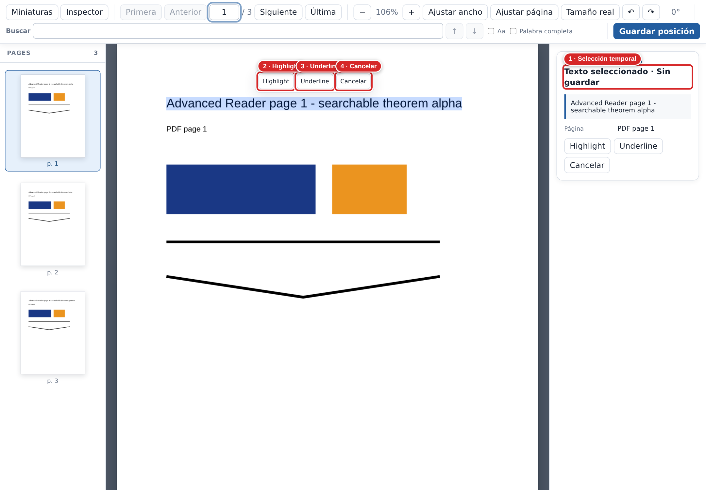{.guide-shot}

La selección todavía no es una marca. **Highlight** y **Underline** inician la
confirmación; **Cancelar** limpia sólo la selección actual.

**Resultado esperado.** El fragmento y la página aparecen en el inspector, y el
PDF conserva zoom, rotación y posición.

**Error frecuente.** Cambiar de página antes de elegir el tipo. La selección
temporal se pierde porque aún no se ha guardado.

**Volver al flujo de lectura.** Pulsa Cancelar o elige un tipo y completa el
guardado.

# 10. Crear un Highlight

**Objetivo.** Guardar un resaltado visual persistente.

1. Selecciona el texto.
2. Pulsa **Highlight**.
3. Revisa fragmento y página.
4. Pulsa **Guardar**.

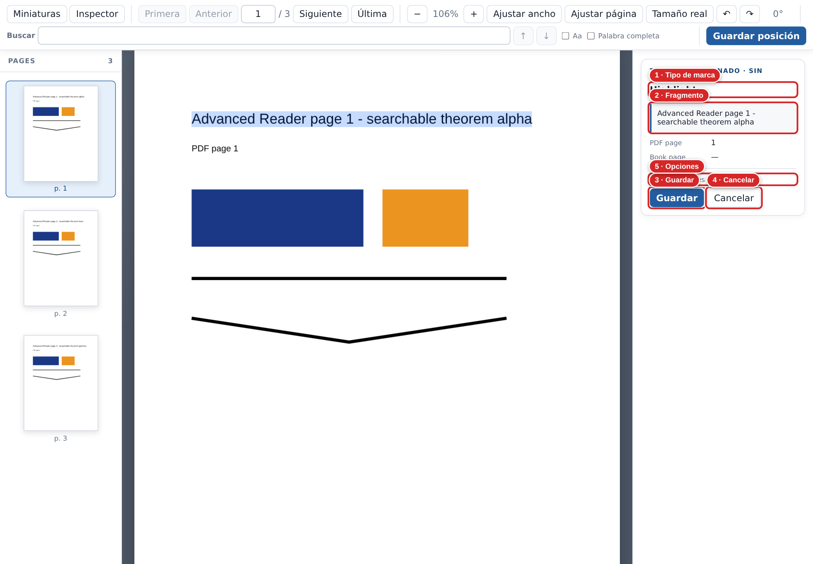{.guide-shot}

No necesitas escribir comentario, tags, color, página o geometría. Abre **Más
opciones** sólo para cambiar color o añadir comentario/tags.

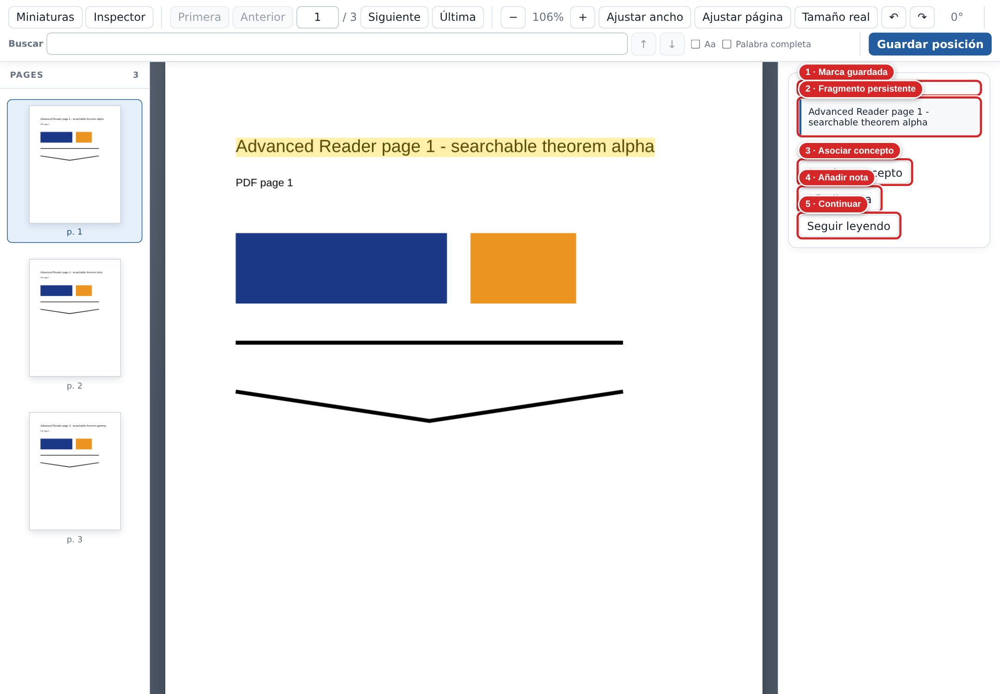{.guide-shot}

**Resultado esperado.** Aparece **Highlight guardado ✓**, el overlay queda sobre
el PDF y se ofrecen Asociar concepto, Añadir nota y Seguir leyendo.

**Error frecuente.** Confundir la pantalla de confirmación con el guardado. La
marca sólo es persistente después de pulsar Guardar y ver el ✓.

**Volver al flujo de lectura.** Pulsa **Seguir leyendo**.

# 11. Crear un Underline

**Objetivo.** Guardar un subrayado visual persistente.

1. Selecciona otro fragmento.
2. Pulsa **Underline**.
3. Revisa la confirmación.
4. Pulsa **Guardar**.

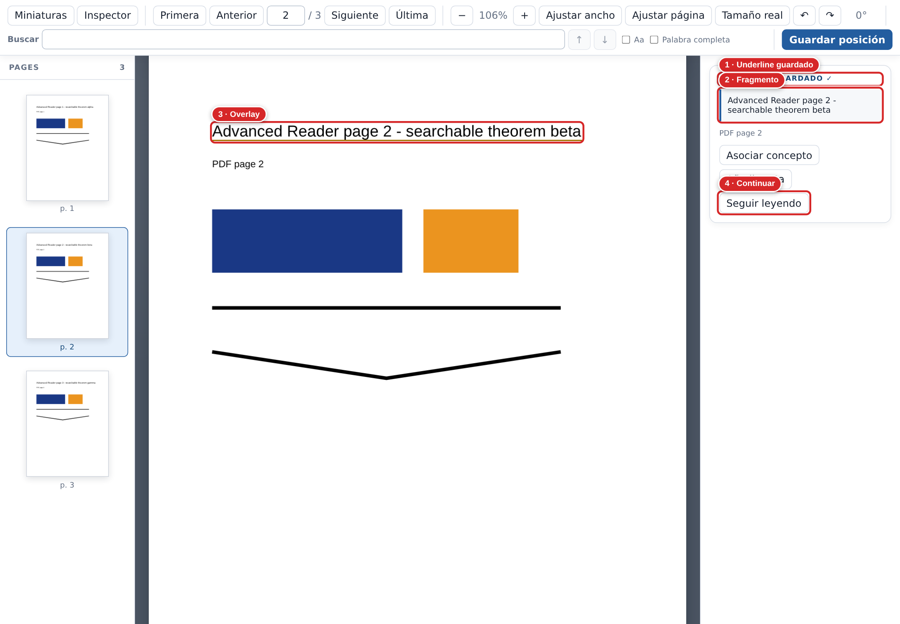{.guide-shot}

**Resultado esperado.** El inspector muestra **Underline guardado ✓** y el
subrayado aparece en la página.

**Error frecuente.** Buscar un campo obligatorio de comentario. No existe en el
flujo normal; es opcional y está en Más opciones.

**Volver al flujo de lectura.** Pulsa Seguir leyendo.

# 12. Selección temporal frente a marca guardada

**Objetivo.** Reconocer cuándo el trabajo está realmente persistido.

| Estado | Señal visible | ¿Persiste al recargar? | Acción siguiente |
|---|---|---:|---|
| Texto seleccionado | “Sin guardar” | No | Highlight, Underline o Cancelar |
| Marca en confirmación | Botones Guardar/Cancelar | No | Guardar |
| Marca guardada | “Highlight/Underline guardado ✓” y overlay | Sí | Asociar concepto, nota o continuar |
| Concepto asociado | “Concepto asociado ✓” | Sí | Volver a leer |

Las capturas 11, 12, 13 y 17 forman una secuencia; no son cuatro paneles
simultáneos. El inspector reemplaza su contenido al avanzar.

**Error frecuente.** Cerrar la pestaña mientras aparece “Sin guardar”. Repite la
selección y llega hasta el estado con ✓.

# 13. Asociar una marca con un concepto

**Objetivo.** Convertir una marca guardada en evidencia de un concepto.

**Dónde está.** En el estado Highlight/Underline guardado.

1. Pulsa **Asociar concepto**.
2. Confirma que el fragmento correcto aparece arriba.

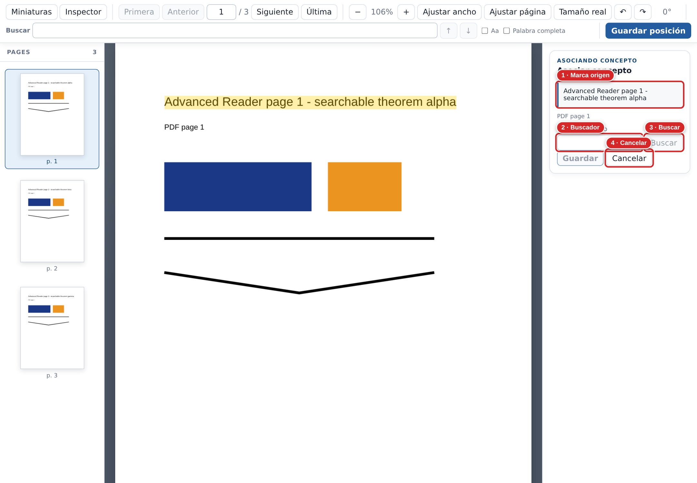{.guide-shot}

**Resultado esperado.** El inspector muestra una única operación de asociación;
no hay un wizard de tres pasos ni IDs técnicos.

**Error frecuente.** Intentar asociar una selección temporal. Primero guarda la
marca y espera el ✓.

**Volver al flujo de lectura.** Pulsa Cancelar; la marca guardada no se elimina.

# 14. Buscar y seleccionar un concepto

**Objetivo.** Elegir la identidad conceptual correcta.

1. Escribe un término legible, por ejemplo “Compacidad”.
2. Pulsa **Buscar**.
3. Revisa las tarjetas de resultados.
4. Pulsa **Seleccionar** en la tarjeta correcta.

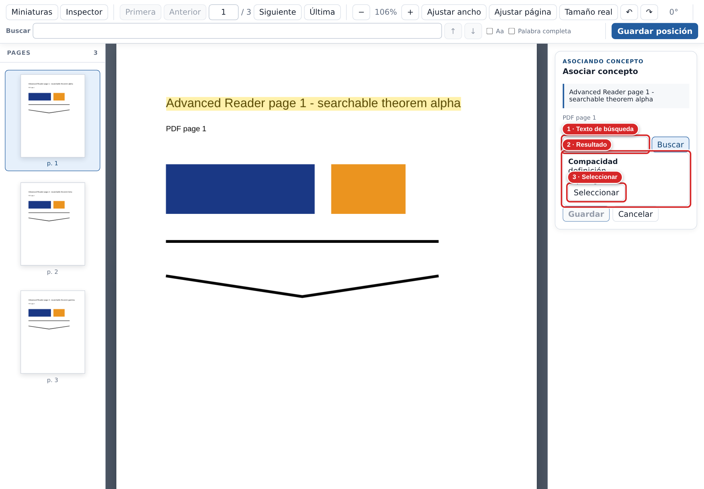{.guide-shot}

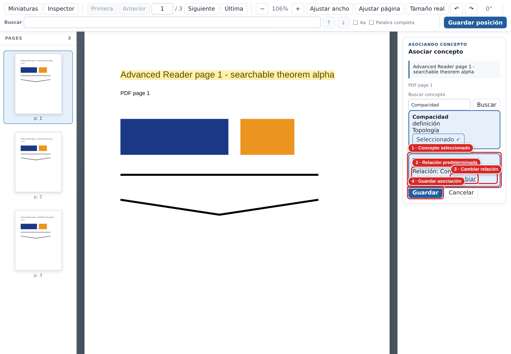{.guide-shot}

La relación visible normal es **Contexto relacionado**. Pulsa **Cambiar** sólo
si necesitas otro tipo de relación o comentario.

**Resultado esperado.** La tarjeta seleccionada queda destacada y el botón
Guardar está disponible.

**Error frecuente.** Pulsar Guardar sin seleccionar resultado. Elige primero
una tarjeta.

**Volver al flujo de lectura.** Cancelar vuelve al PDF sin borrar la marca.

# 15. Guardar una asociación

**Objetivo.** Persistir el vínculo entre la marca y el concepto.

1. Verifica concepto y relación.
2. Pulsa **Guardar**.
3. Espera el mensaje **Concepto asociado ✓**.

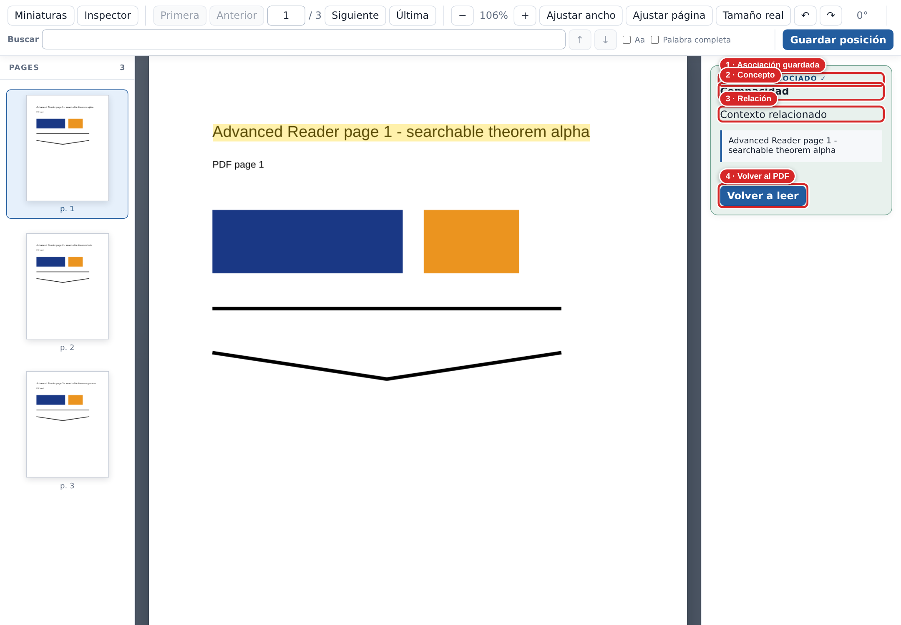{.guide-shot}

**Resultado esperado.** Se muestran concepto, relación, fragmento y página; el
buscador se cierra. El PDF conserva página, zoom y rotación.

**Error frecuente.** Salir antes del ✓. Si no aparece, revisa la disponibilidad
de asociación en Solución de problemas.

**Volver al flujo de lectura.** Pulsa **Volver a leer**.

# 16. Revisar conceptos vinculados

**Objetivo.** Comprobar asociaciones y detectar marcas pendientes.

En Advanced Reader pulsa **Revisar marcas** y después **Conocimiento**.

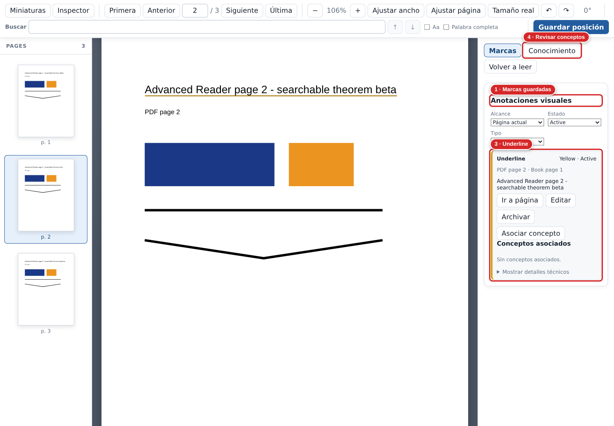{.guide-shot}

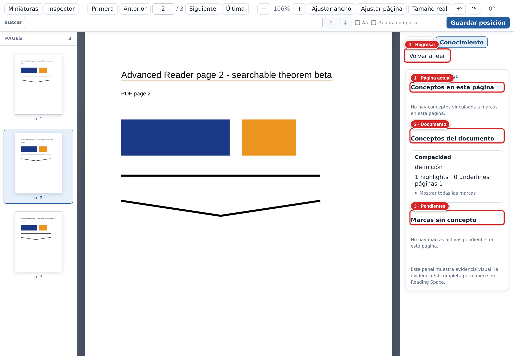{.guide-shot}

El panel separa:

- **Conceptos en esta página**;
- **Conceptos del documento**;
- **Marcas sin concepto**.

**Resultado esperado.** El concepto asociado ya no aparece como pendiente; las
otras marcas siguen disponibles para vincular.

**Error frecuente.** Revisar una página distinta y pensar que el vínculo se
perdió. Comprueba también Conceptos del documento.

**Volver al flujo de lectura.** Pulsa Volver a leer.

# 17. Nota rápida

**Objetivo.** Guardar una ReadingNote con el mínimo de campos visibles.

**Dónde está.** Reading Space → Leer → **Nota rápida**.

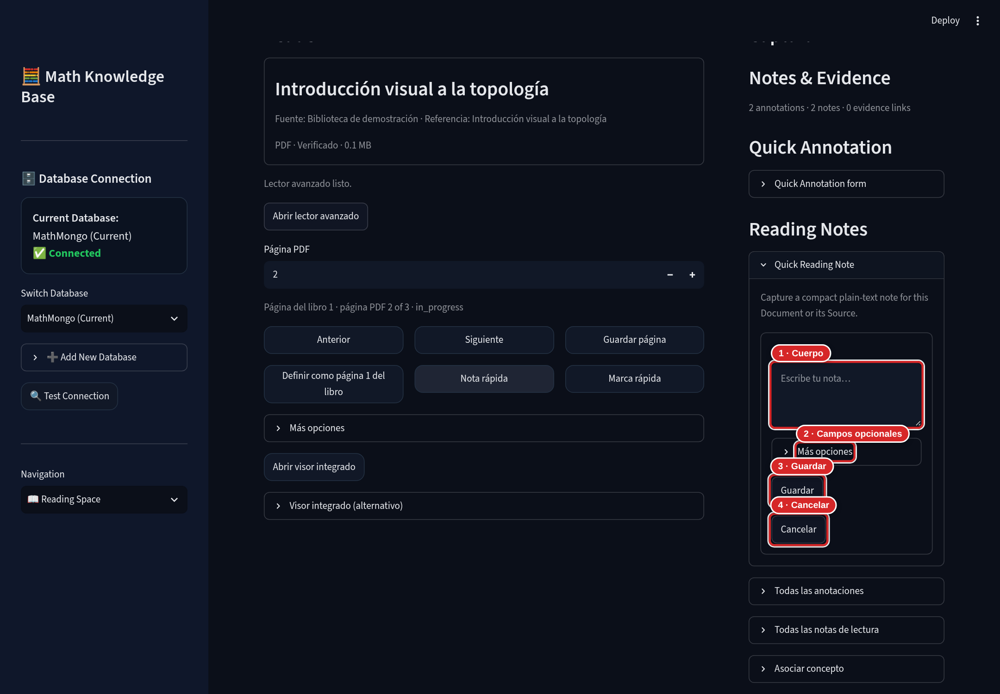{.guide-shot}

1. Escribe el cuerpo de la nota.
2. Abre Más opciones sólo si necesitas título personalizado, tipo, rango de
   páginas o etiquetas.
3. Pulsa **Guardar**.
4. Revisa la nota en Cuaderno.

El título se deriva de la primera línea cuando no escribes uno personalizado.
Documento, página, Source y Reference se completan automáticamente.

**Resultado esperado.** La nota aparece en Cuaderno, agrupada con su documento y
página.

**Error frecuente.** Intentar guardar desde el formulario de Nota rápida del
Advanced Reader. La interfaz actual indica que la persistencia de ReadingNote se
realiza desde Leer en Reading Space.

**Volver al flujo de lectura.** Tras Guardar, permanece en Leer; continúa con el
PDF o abre Cuaderno para revisar.

# 18. Cuaderno

**Objetivo.** Revisar highlights, underlines, anotaciones y notas.

**Dónde está.** Reading Space → **Cuaderno**.

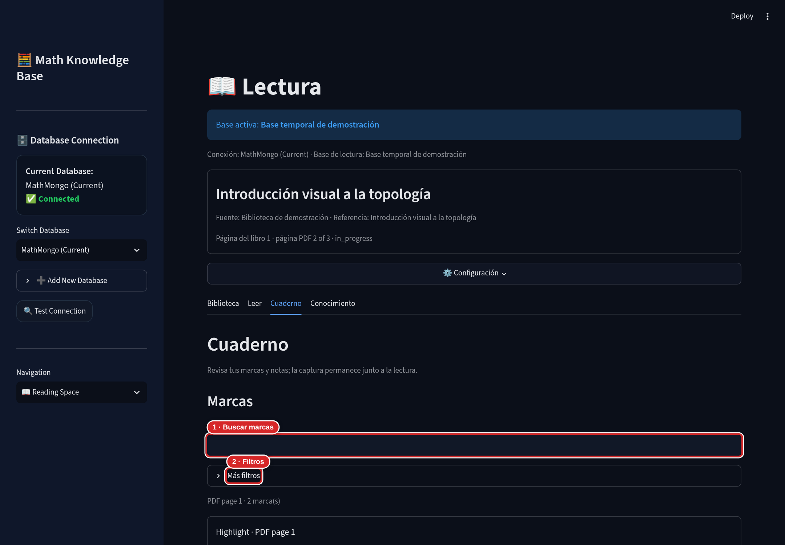{.guide-shot}

Los filtros por estado y tipo permanecen cerrados dentro de **Más filtros**.
La búsqueda sencilla está siempre visible.

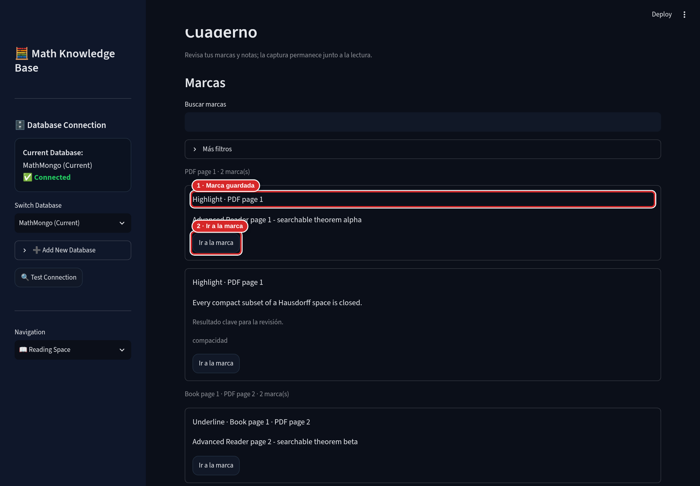{.guide-shot}

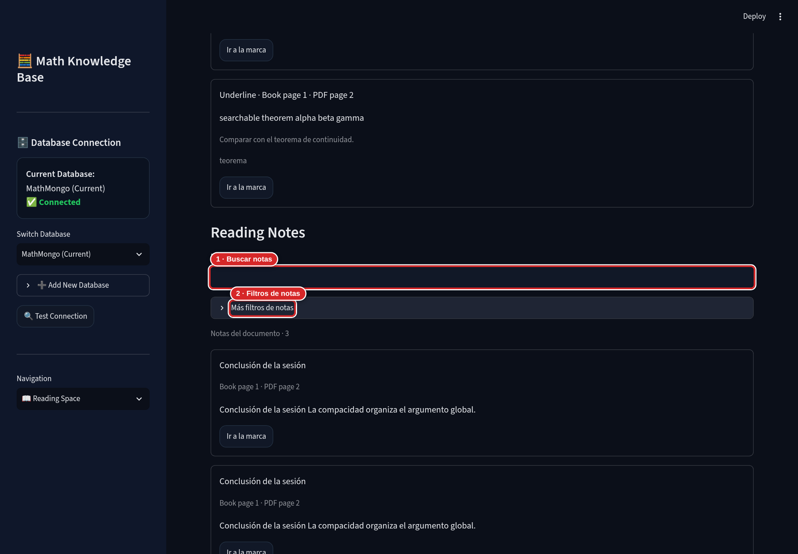{.guide-shot}

1. Busca una frase, título o etiqueta.
2. Revisa el grupo de página.
3. Pulsa **Ir a la marca** para volver a Leer en esa página.

**Resultado esperado.** La revisión no abre formularios de creación y no muestra
IDs por defecto.

**Error frecuente.** Buscar aquí el flujo principal de creación. Las marcas se
crean durante la lectura y Cuaderno sirve para revisarlas.

**Volver al flujo de lectura.** Usa Ir a la marca o pulsa Leer.

# 19. Conocimiento

**Objetivo.** Revisar conceptos y evidencia de forma transversal.

**Dónde está.** Reading Space → **Conocimiento**.

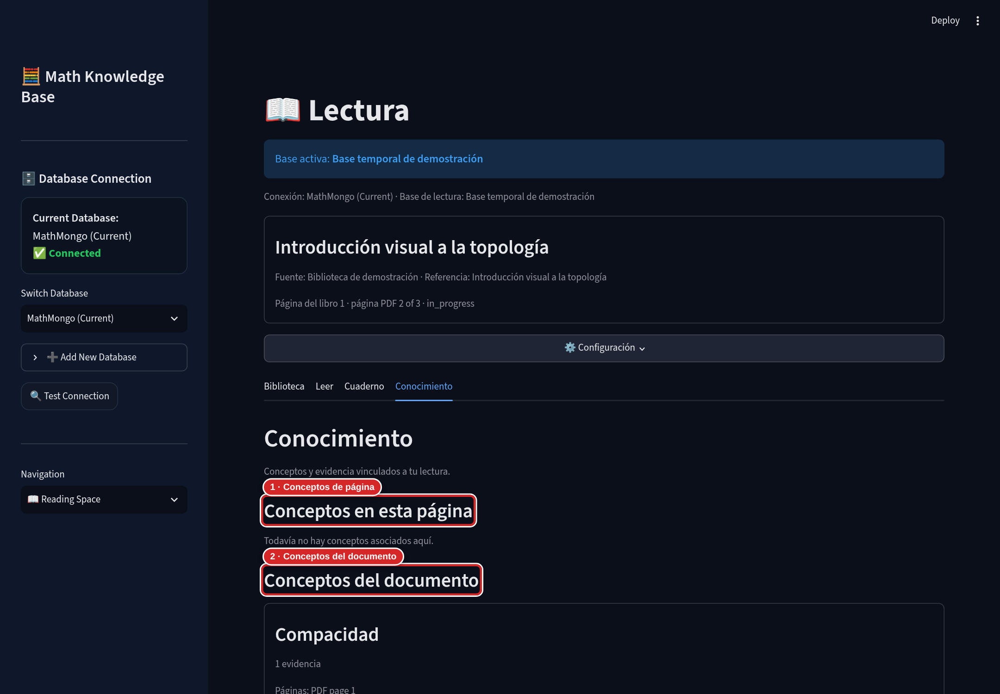{.guide-shot}

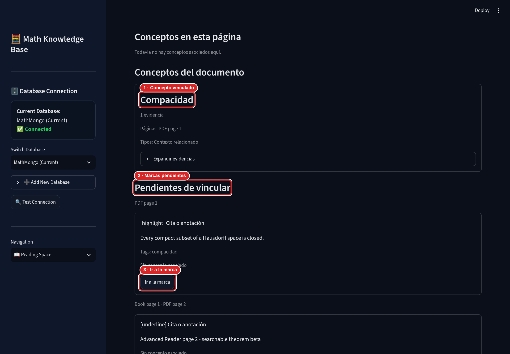{.guide-shot}

1. Revisa Conceptos en esta página.
2. Amplía la mirada con Conceptos del documento.
3. Localiza Pendientes de vincular.
4. Pulsa **Ir a la marca** para regresar al contexto.

**Resultado esperado.** Las asociaciones guardadas muestran concepto, página y
tipo de relación; las marcas sin asociación permanecen separadas.

**Error frecuente.** Esperar un formulario largo en Conocimiento. La asociación
se realiza junto al PDF, no en esta vista de revisión.

**Volver al flujo de lectura.** Ir a la marca conserva el documento y prepara la
página correspondiente en Leer.

# 20. Configuración

**Objetivo.** Acceder a tareas secundarias sin mezclarlas con la lectura.

**Dónde está.** Botón **⚙️ Configuración**, encima de las cuatro pestañas.

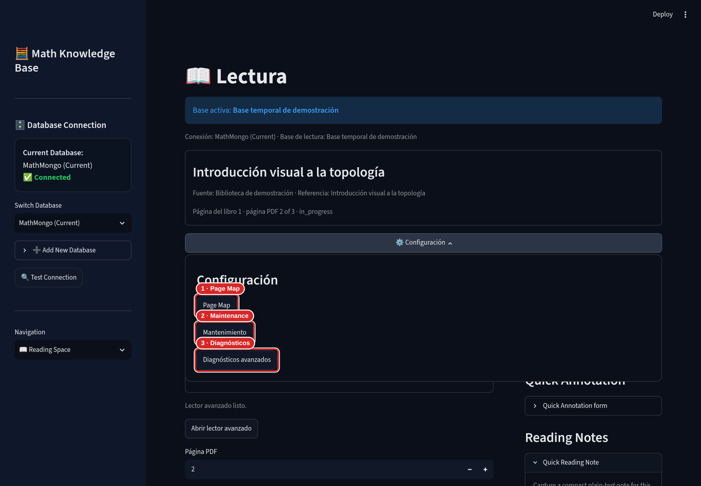{.guide-shot}

Contiene tres destinos:

1. **Page Map**: etiquetas impresas del libro.
2. **Mantenimiento**: inicialización y lifecycle administrativo.
3. **Diagnósticos avanzados**: estado técnico e índices.

**Resultado esperado.** El menú permanece cerrado durante la lectura normal y
no aparece como una quinta pestaña.

**Error frecuente.** Entrar en diagnósticos para realizar una lectura normal.
Úsalos sólo cuando Guardar o una capacidad aparezcan indisponibles.

**Volver al flujo de lectura.** Cierra el popover o pulsa Leer.

# 21. Page Map

**Objetivo.** Relacionar páginas PDF con la numeración impresa del libro.

**Dónde está.** Configuración → **Page Map**.

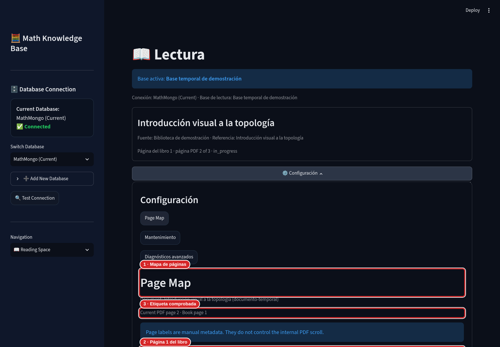{.guide-shot}

Recorrido rápido:

1. En Leer, ve a la página PDF que corresponde a la página 1 del libro.
2. Abre Configuración → Page Map.
3. Pulsa **Set current PDF page as Book page 1**.
4. Comprueba la etiqueta “Book page 1 · PDF page N”.

**Resultado esperado.** Leer, Cuaderno, Conocimiento y Advanced Reader pueden
mostrar la etiqueta de libro junto a la página PDF.

**Error frecuente.** Esperar que Page Map cambie el contenido o scroll del PDF.
Sólo añade metadata de numeración.

**Volver al flujo de lectura.** Cierra Configuración y continúa en Leer.

# 22. Maintenance

**Objetivo.** Consultar o habilitar capacidades administrativas cuando exista
un problema explícito.

**Dónde está.** Configuración → **Mantenimiento**.

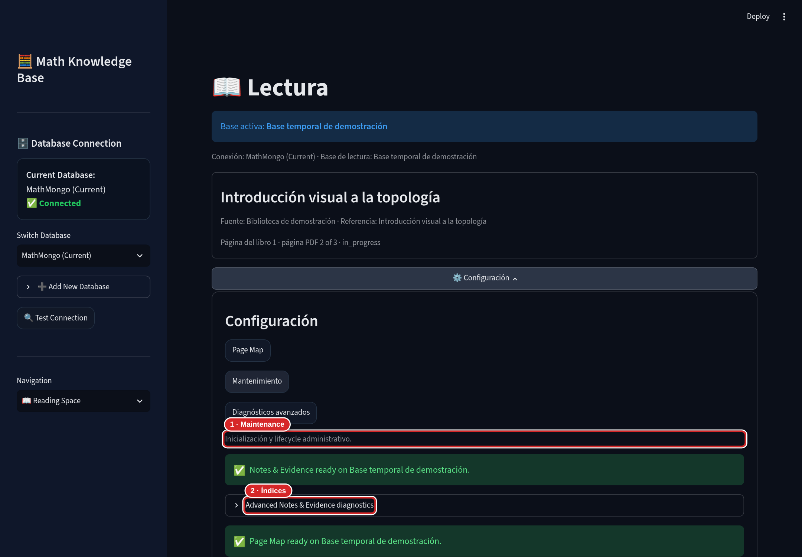{.guide-shot}

Los paneles avanzados permanecen cerrados. No inicialices ni cambies lifecycle
si la lectura y el guardado ya funcionan.

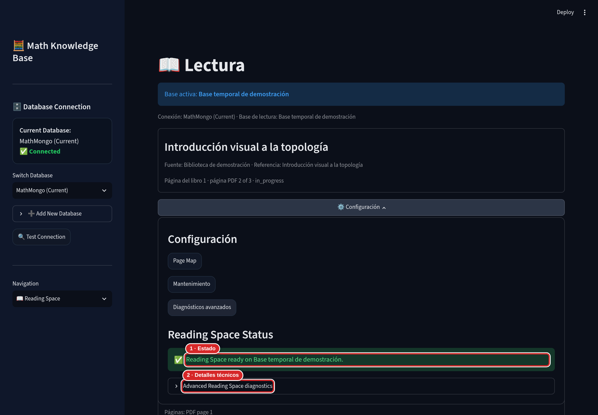{.guide-shot}

**Resultado esperado.** Los estados correctos aparecen en verde. Los detalles
técnicos sólo se muestran al abrir su expander.

**Error frecuente.** Escribir el nombre de una base o confirmar una acción sin
haber identificado un problema. Cancela y consulta primero el estado.

**Volver al flujo de lectura.** Cierra Configuración; los diagnósticos no cambian
el documento activo.

# 23. Cerrar MathMongo correctamente

**Objetivo.** Detener únicamente los procesos iniciados en tu terminal.

1. Guarda la posición si quieres continuar más tarde.
2. Cierra o deja de usar las pestañas del navegador.
3. Vuelve a la terminal donde ejecutaste `make run`.
4. Pulsa **Ctrl+C una sola vez**.
5. Espera el mensaje de cierre de Streamlit y Advanced Reader.

Un código de salida **130** después de Ctrl+C significa interrupción voluntaria;
no indica corrupción de datos.

**Error frecuente.** Usar `pkill`, `killall` o cerrar procesos ajenos. No es
necesario en el flujo normal y puede detener sesiones de otra persona.

**Resultado esperado.** Los dos puertos quedan libres y MongoDB conserva los
datos ya guardados.

# 24. Solución de problemas

## Advanced Reader no inicia

Comprueba primero que MathMongo siga activo y que abriste un PDF desde Leer.
Después consulta:

```bash
curl --fail http://127.0.0.1:8766/api/advanced-reader/health
```

Si responde con estado `ok`, vuelve a Leer y pulsa Abrir lector avanzado.

## El puerto 8766 está ocupado

No detengas el proceso desconocido. Inicia tus servicios en puertos alternos:

```bash
STREAMLIT_PORT=8502 ADVANCED_READER_PORT=8767 make run
```

Abre entonces `http://127.0.0.1:8502`.

## El lector usa una base diferente

Detén tu propio `make run` con Ctrl+C y reinicia indicando la base esperada:

```bash
DATABASE=MathV0 make run
```

El health del lector informa el nombre de base sin necesidad de abrir tablas.

## Document no encontrado

Vuelve a Biblioteca, actualiza la página y selecciona nuevamente la tarjeta. Si
el documento fue archivado, consulta Más opciones o Mantenimiento con cuidado.

## El PDF no se renderiza

1. Espera unos segundos y comprueba que el contador de páginas aparezca.
2. Recarga sólo la pestaña del lector.
3. Prueba el **Visor integrado (alternativo)** desde Leer.

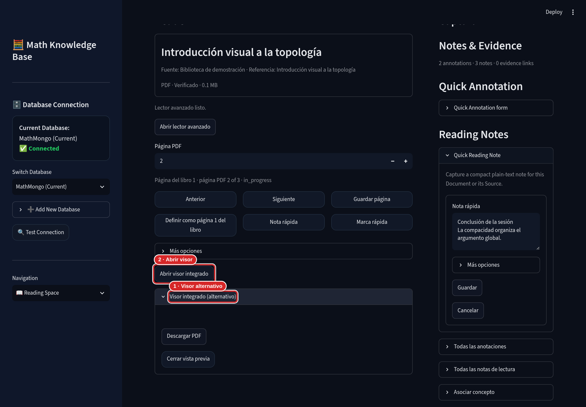{.guide-shot}

## Highlight o Underline no puede guardarse

Comprueba que:

- el documento está activo;
- el inspector muestra una selección real;
- la confirmación contiene fragmento y página;
- Configuración no informa que Guardar está indisponible.

Cancelar limpia únicamente la operación actual; no elimina marcas anteriores.

## Asociar concepto está deshabilitado

La marca debe estar guardada, el documento debe estar activo y la búsqueda de
conceptos disponible. Revisa Configuración → Mantenimiento sólo si aparece un
mensaje de indisponibilidad.

## Page Map no está configurado

No bloquea la lectura. Las páginas seguirán mostrándose como PDF page. Configura
Book page 1 más tarde siguiendo el capítulo 21.

## `make run` termina con código 130

Si ocurrió justo después de Ctrl+C, es el cierre normal solicitado por el
usuario. No reinicies MongoDB ni repares datos.

## Warning de Session State

Recarga una vez la pestaña de Streamlit y vuelve a Reading Space. Evita operar
la misma sesión de Streamlit simultáneamente desde varias pestañas.

## Comprobar health

```bash
curl --fail http://127.0.0.1:8501/_stcore/health
curl --fail http://127.0.0.1:8766/api/advanced-reader/health
```

Ambos comandos son de sólo lectura. Si cambiaste los puertos, sustitúyelos en
las direcciones.

# Recorridos completos

## Recorrido 1 — Abrir un documento por primera vez

Biblioteca → busca la tarjeta → **Leer** → Leer → **Abrir lector avanzado**.

**Comprobación:** el PDF aparece en Advanced Reader y el inspector muestra su
página actual.

## Recorrido 2 — Continuar una lectura

Biblioteca → **Continuar leyendo** → **Continuar** → verifica la última página →
Abrir lector avanzado.

**Comprobación:** página, miniatura activa y progreso coinciden.

## Recorrido 3 — Crear un Highlight

Selecciona texto → Highlight → revisa fragmento/página → Guardar → espera
**Highlight guardado ✓** → confirma el overlay.

## Recorrido 4 — Crear un Underline

Selecciona texto → Underline → revisa → Guardar → espera **Underline guardado
✓**.

## Recorrido 5 — Asociar concepto

Marca guardada → Asociar concepto → buscar → seleccionar → comprobar relación →
Guardar → esperar **Concepto asociado ✓** → Volver a leer.

## Recorrido 6 — Crear una nota rápida

Leer → Nota rápida → escribir cuerpo → Guardar → Cuaderno → localizar la nota.

## Recorrido 7 — Revisar conocimiento

Conocimiento → localizar concepto → expandir evidencia si hace falta → **Ir a la
marca** → volver al PDF.

## Recorrido 8 — Configurar páginas del libro

Leer en PDF page N → Configuración → Page Map → Set current PDF page as Book
page 1 → comprobar Book page 1.

# Qué escribe la persona y qué completa MathMongo

| Lo que escribe o elige la persona | Cuándo |
|---|---|
| Búsqueda de concepto | Al asociar una marca |
| Cuerpo de nota | En Nota rápida |
| Tipo de marca | Highlight o Underline |
| Comentario opcional | En Más opciones |
| Tags opcionales | En Más opciones |
| Relación distinta de la predeterminada | Sólo si pulsa Cambiar |

| Lo que completa MathMongo automáticamente | Procedencia |
|---|---|
| Documento, Source y Reference | Documento activo |
| Página PDF | Visor actual |
| Página del libro | Page Map, si existe |
| Identidad de la marca | Guardado de la anotación |
| Identidad del concepto | Tarjeta seleccionada |
| Relación predeterminada | Contexto relacionado |
| Geometría y posición del overlay | Selección real del PDF |

# Glosario

**Advanced Reader.** Lector PDF.js local con búsqueda, miniaturas, marcas y
asociación conceptual.

**Highlight.** Marca visual que resalta el fondo del texto.

**Underline.** Marca visual que subraya el texto.

**Overlay.** Representación visual de una marca guardada sobre el PDF.

**Page Map.** Reglas manuales que relacionan páginas PDF con numeración impresa.

**ReadingNote.** Nota persistente vinculada a una lectura, documento y, cuando
corresponde, página.

**Source.** Obra o fuente general que puede reunir cero, uno o varios
Documents.

**Reference.** Ficha bibliográfica concreta y opcional, por ejemplo una edición
o un artículo. Durante la lectura, MathMongo recupera Source y Reference del
documento activo sin pedirlas de nuevo.

**Document.** Recurso asociado a una Source; en esta guía suele ser un PDF.

**Lifecycle.** Estado administrativo activo/archivado. Se gestiona fuera del
flujo normal.

# Apéndice opcional — Qué guarda MathMongo internamente

Al guardar una marca, MathMongo conserva la identidad interna de la anotación,
el documento, Source, Reference, página PDF, página del libro cuando existe,
tipo, fragmento, geometría, rotación de captura y opciones elegidas. Al asociar
un concepto conserva además la identidad exacta del concepto, relación,
procedencia y comentario opcional.

Estos valores permiten reconstruir overlays y navegar a evidencia sin pedir al
usuario que copie IDs, rutas, hashes o estructuras de MongoDB. Por eso no
aparecen como campos editables en el flujo principal.

<div class="page-break"></div>

# Lista de comprobación rápida

- ¿Por dónde comienzo? Si no existe la Source, Add Source; si falta el PDF,
  Edit / Analyze Source → Documents; si ya hay PDF, Biblioteca.
- ¿Cómo abro un PDF? Leer → Abrir lector avanzado.
- ¿Cómo regreso al documento? Cierra la pestaña avanzada o pulsa Volver a leer.
- ¿Cómo creo una marca? Selecciona → Highlight/Underline → Guardar.
- ¿Cuándo está guardada? Cuando aparece el ✓ y el overlay.
- ¿Cómo vinculo un concepto? Marca guardada → Asociar concepto → buscar →
  seleccionar → Guardar.
- ¿Dónde reviso notas y marcas? Cuaderno.
- ¿Dónde reviso conceptos? Conocimiento.
- ¿Qué es Configuración? Acceso secundario a Page Map, Maintenance y
  diagnósticos.
- ¿Cómo cierro? Ctrl+C en la terminal que ejecutó `make run`.
