# Guía de Reading Space en MathMongo

**Versión documentada:** MathMongo 0.13.0

**Fecha de actualización:** 19 de julio de 2026

**Alcance:** Sources gestionadas, conceptos, lectura de PDF, anotaciones, evidence, Cuaderno, Document Builder y mapas de conocimiento.

> **Regla de seguridad:** antes de crear, editar, importar, promover o enlazar cualquier dato, confirma el nombre de la base MongoDB real que aparece en la barra lateral y en el encabezado de la página. El nombre de una conexión no sustituye esta comprobación.

Las imágenes de esta guía proceden de una única base temporal con datos sintéticos. Los identificadores largos son ejemplos reales del formato generado por MathMongo, no datos personales.

## 1. Introducción

Reading Space convierte una Source bibliográfica y sus documentos en un flujo de trabajo trazable:

1. una **Source gestionada** identifica el corpus;
2. una **Reference** registra los datos bibliográficos;
3. un **Source Document** adjunta el PDF o una URL;
4. Reading Space conserva la posición, las marcas y las notas;
5. **evidence** enlaza una observación de lectura con un Concept;
6. Cuaderno permite incubar material antes de promoverlo;
7. el conocimiento consolidado puede reutilizarse en Document Builder y en grafos o mapas.

La idea central de v0.13.0 es separar dos identidades:

| Identidad | Ejemplo | Para qué sirve |
|---|---|---|
| Source gestionada | `source_id = src_<uuid>` | Identidad estable del corpus, aunque cambie su nombre visible. |
| Concept heredado | `id@source`, por ejemplo `espacio_vectorial@GuiaAlgebraLineal` | Clave histórica exacta con la que siguen trabajando varias vistas. |

Un Concept nuevo conserva ambas perspectivas: su `source` es el nombre histórico visible y su `source_id` apunta a la Source gestionada. No edites estos campos directamente en MongoDB.

## 2. Requisitos

Antes de comenzar:

- MongoDB debe estar disponible en la conexión local configurada.
- La aplicación debe iniciarse con el entorno del proyecto.
- La base objetivo debe existir o poder crearse explícitamente.
- Para leer PDF en el visor avanzado, el servicio Advanced Reader debe estar activo.
- El navegador debe permitir conexiones a los puertos locales elegidos.

El arranque habitual levanta Streamlit y Advanced Reader juntos:

```bash
make run DATABASE="NombreExactoDeLaBase" STREAMLIT_PORT=8501 ADVANCED_READER_PORT=8766
```

Si esos puertos están ocupados, usa otros dos puertos libres y mantén el mismo nombre de base:

```bash
make run DATABASE="NombreExactoDeLaBase" STREAMLIT_PORT=8502 ADVANCED_READER_PORT=8767
```

Comprueba la salud de la interfaz abriendo la URL de Streamlit. Advanced Reader debe indicar que está listo cuando abras un documento PDF desde Reading Space.

## 3. Flujo general

El recorrido recomendado es:

1. **Base activa:** confirma la base real, no sólo el perfil de conexión.
2. **Add Source:** crea la Source y, si corresponde, una Reference.
3. **Documents:** adjunta el PDF a esa Source y comprueba su integridad.
4. **Add Concept:** crea Concepts seleccionando una Source gestionada activa.
5. **Biblioteca:** localiza el documento en Reading Space.
6. **Leer:** abre el PDF, ajusta la página lógica y guarda la posición.
7. **Advanced Reader:** usa búsqueda, miniaturas y marcas visuales.
8. **Annotations / Reading Notes:** registra citas, preguntas e ideas.
9. **Evidence:** enlaza una marca o nota con el Concept exacto.
10. **Cuaderno:** revisa el material asociado a la lectura.
11. **Promote:** convierte una nota madura del Diario LaTeX en un Concept nuevo.
12. **Knowledge Base:** edita, relaciona, compone documentos y construye mapas.

No es necesario completar todos los pasos en una sola sesión. La posición, las notas y los enlaces se guardan en la base activa.

## 4. Base activa

La barra lateral muestra la tarjeta **Current Database**, el estado de conexión y el selector **Switch Database**. Muchas páginas repiten la base real en un banner superior.

La siguiente captura es el punto de control previo a cualquier escritura.

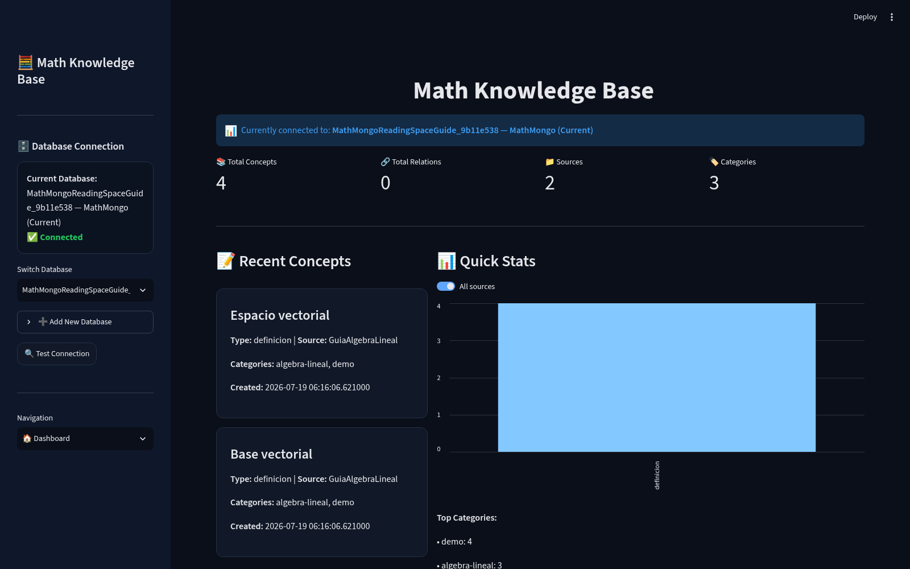

**Qué observar:**

- `Current Database` contiene el nombre real de MongoDB.
- El estado es `Connected`.
- El banner principal repite la base junto al nombre del perfil.
- Los conceptos recientes pertenecen al corpus de demostración esperado.

**Siguiente acción:** si el nombre no es el esperado, no pulses botones de guardar. Cambia de conexión o reinicia la aplicación con `DATABASE="..."`, vuelve al Dashboard y verifica de nuevo.

### Cambio seguro de base

1. Termina o cancela cualquier formulario abierto.
2. Usa **Switch Database**.
3. Espera a que Streamlit termine de recargar.
4. Compara la tarjeta lateral y el banner de la nueva página.
5. Abre Dashboard o Add Source y confirma la base real una segunda vez.
6. Si Advanced Reader estaba abierto en otra pestaña, ciérralo y vuelve a abrirlo desde el documento de la nueva base.

La sesión visual puede conservar controles antiguos durante una recarga breve. No actúes hasta que la página nueva muestre de forma coherente la base seleccionada.

## 5. Crear una Source

En la navegación lateral elige **➕ Add Source**. El bloque **Catalog Status** debe indicar que el catálogo está listo; si faltan índices, inicialízalos sólo después de escribir y confirmar el nombre exacto de la base.

### Campos principales

- **Name:** nombre humano del corpus. Debe ser estable y reconocible.
- **Source type:** book, article, thesis, web, course u otro tipo admitido.
- **Description:** alcance del corpus.
- **Language:** idioma principal, por ejemplo `es`.
- **Aliases:** nombres alternativos conocidos.
- **Tags:** etiquetas de búsqueda.
- **Default rights:** copyright, redistribución, licencia y notas.

`source_id` no se escribe manualmente: MathMongo lo genera después de validar la Source. El formulario siguiente está preparado para revisión, sin ejecutar la escritura.

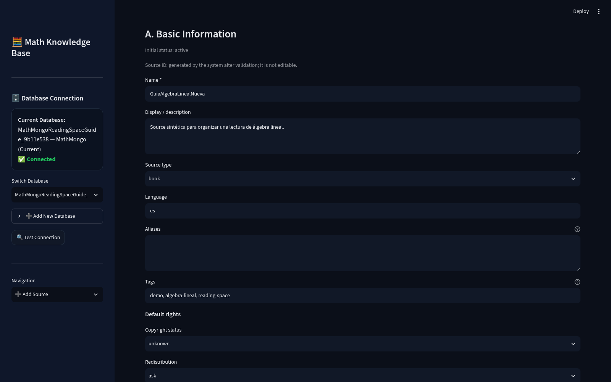

**Qué observar:** la base activa permanece visible; el tipo es `book`; el nombre y las etiquetas describen el corpus. El nombre `GuiaAlgebraLinealNueva` ilustra un alta nueva y deliberadamente distinta de la Source ya existente.

**Siguiente acción:** revisa **Preview Source**, añade References opcionales y activa la confirmación de escritura exclusiva antes de pulsar **Create Source and selected References**.

### Reference opcional

Puedes crear una Reference manualmente o importar una selección BibTeX. Para una referencia manual registra, como mínimo, título, autor y año cuando estén disponibles. No inventes ISBN o DOI.

Una Reference puede asociarse a una o varias Sources. Su `reference_id` también es estable y generado por el sistema.

### Adjuntar un PDF

1. Abre **✏️ Edit / Analyze Source**.
2. Busca y selecciona la Source.
3. Cambia **Section** a **Documents**.
4. Abre la pestaña **ADD PDF**.
5. Elige el archivo, asigna título y metadatos, y confirma la escritura.
6. Regresa a **LIST** y usa **Comprobar integridad**.

La vista Documents muestra el vínculo entre documento, Reference, idioma, etiquetas y metadatos del PDF.

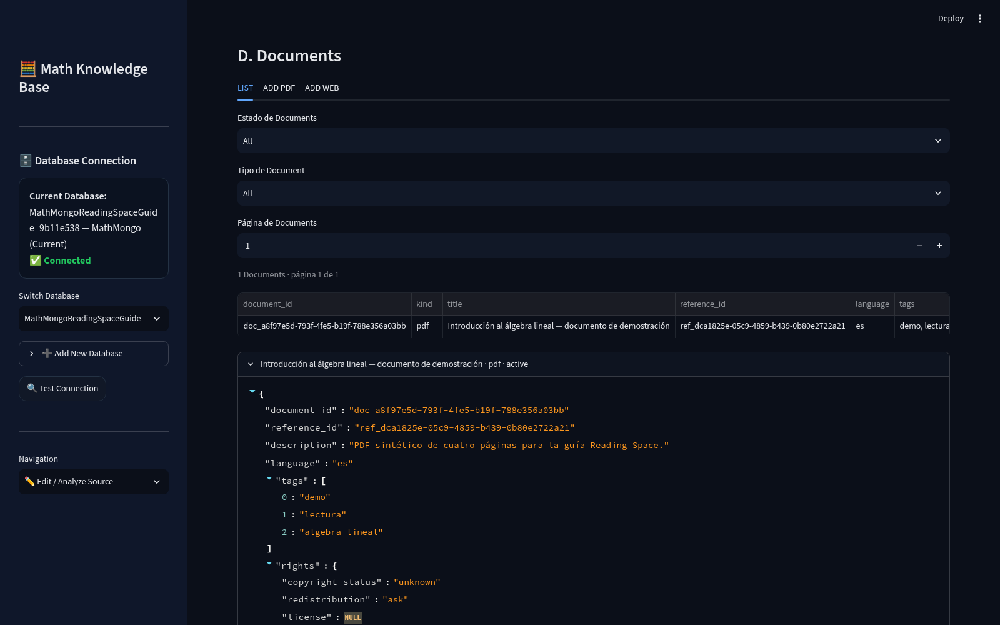

**Qué observar:** el registro es `pdf`, está `active`, tiene `document_id` estable y conserva `reference_id`. La descripción declara que es un PDF sintético de cuatro páginas.

**Siguiente acción:** pulsa **Open in Reading Space** o navega a Reading Space y localiza el documento en Biblioteca.

> **Importante:** archivar una Source es la operación normal de retirada. La eliminación física queda bloqueada si existen References, Documents, Concepts u otras dependencias.

## 6. Añadir un concepto nuevo

En **➕ Add Concept**, los campos mínimos son:

- **Concept Type**;
- **ID** único dentro de la Source histórica;
- **Source** gestionada activa;
- contenido LaTeX;
- título y categorías recomendados.

La selección de Source no es texto libre: se elige una Source activa del catálogo. Al guardar, MathMongo persiste:

- `id`: identidad histórica del Concept;
- `source`: snapshot del nombre visible de la Source;
- `source_id`: vínculo estable a la Source gestionada.

La vista lista los IDs ya existentes para evitar una colisión dentro del mismo corpus.

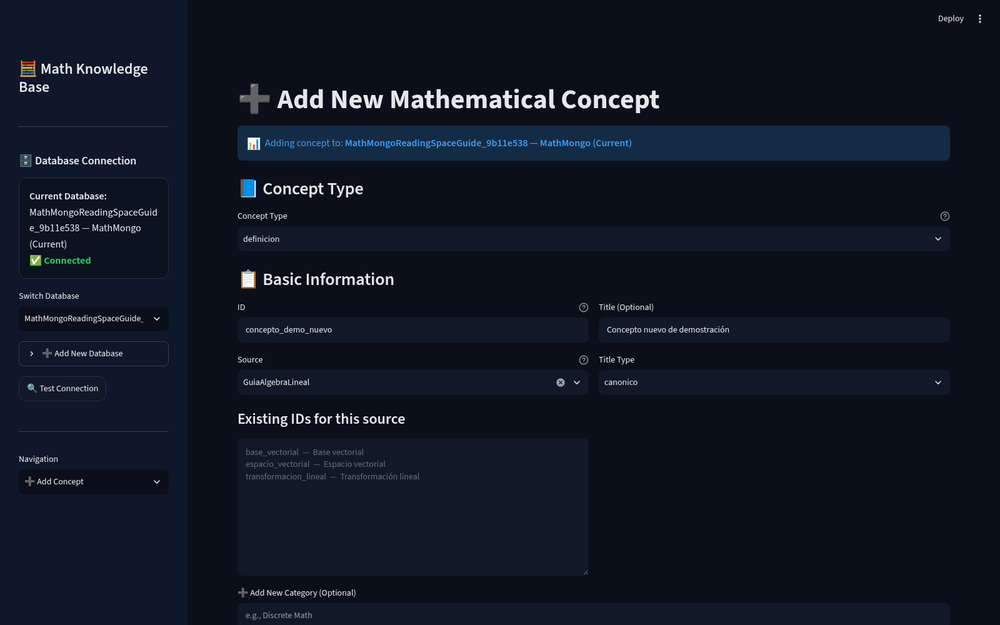

**Qué observar:** la base se repite en el banner; `GuiaAlgebraLineal` está seleccionada; el panel muestra `base_vectorial`, `espacio_vectorial` y `transformacion_lineal` como IDs ya ocupados.

**Siguiente acción:** elige un ID nuevo, escribe el LaTeX, revisa categorías y metadatos, y guarda. Si el ID ya existe, abre **Edit Concept** en lugar de intentar sobrescribirlo.

### Convención recomendada para IDs

- usa minúsculas y guion bajo;
- evita espacios, tildes y signos dependientes del sistema;
- expresa el concepto, no el título del documento;
- conserva el mismo ID cuando sólo corrijas contenido;
- trata `id@source` como una clave exacta.

## 7. Abrir Reading Space

Elige **📖 Reading Space**. La pestaña **Biblioteca** lista únicamente documentos accesibles desde Sources activas y permite buscar por título o aplicar más filtros.

Cada tarjeta resume:

- título del documento;
- Source y Reference;
- tipo de documento;
- estado de lectura;
- última página PDF guardada.

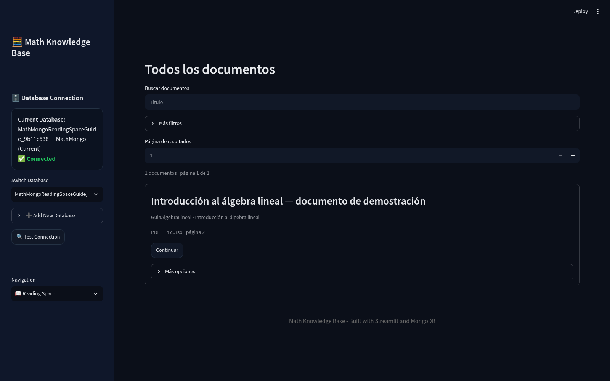

**Qué observar:** aparece un solo documento sintético; el estado es **En curso** y la posición guardada es la página 2.

**Siguiente acción:** pulsa **Continuar**. Reading Space seleccionará el documento y abrirá la pestaña **Leer**.

Las cuatro pestañas principales son:

| Pestaña | Función |
|---|---|
| Biblioteca | Buscar y seleccionar documentos. |
| Leer | Abrir el lector, guardar página y crear capturas rápidas. |
| Cuaderno | Revisar marcas y notas ligadas al documento. |
| Conocimiento | Ver Concepts enlazados, evidence y elementos pendientes. |

## 8. Leer en Advanced Reader

En **Leer**, pulsa **Abrir lector avanzado**. El lector se abre con el `document_id` exacto y usa el mismo backend local que se inició con la aplicación.

La barra superior permite:

- ir a primera, anterior, siguiente o última página;
- escribir un número de página PDF;
- cambiar zoom y ajustar ancho o página;
- rotar;
- buscar texto con opciones de mayúsculas y palabra completa;
- guardar la posición.

Las miniaturas ayudan a verificar que el PDF correcto está abierto.

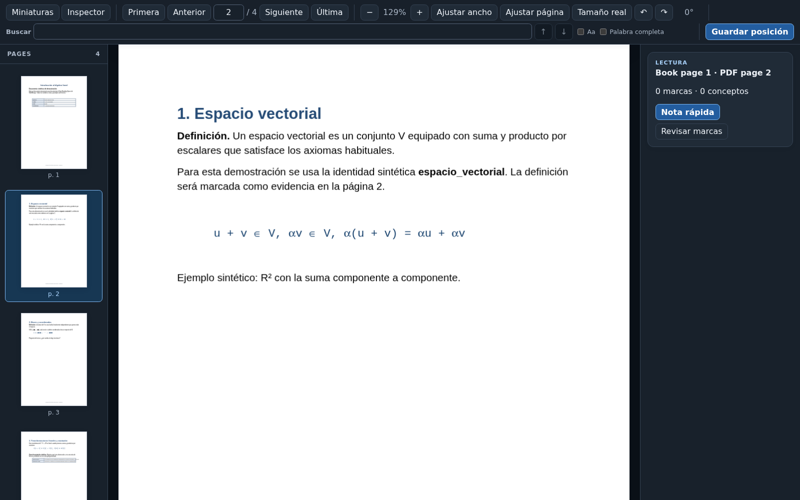

**Qué observar:** la barra indica `2 / 4`; la miniatura `p. 2` está seleccionada; el panel derecho distingue **Book page 1** de **PDF page 2**.

**Siguiente acción:** selecciona texto para crear una marca o vuelve a Reading Space para registrar una anotación lógica o una nota.

### Página PDF y página del libro

Un PDF puede comenzar con portada, créditos o índice. Por eso Reading Space separa:

- **PDF page:** posición física del archivo;
- **Book page:** numeración lógica del contenido.

En **Leer**, sitúate en la primera página numerada del libro y usa **Definir como página 1 del libro**. Revisa el resultado antes de crear evidence, porque la página lógica aparecerá en las citas y tarjetas de conocimiento.

## 9. Crear anotaciones y evidence

Reading Space admite dos registros principales:

- **Annotation:** marca, cita, comentario, pregunta o bookmark asociado a un documento y, opcionalmente, a una página.
- **Reading Note:** nota más desarrollada asociada a Source, documento y rango de páginas.

En **Leer → Notes & Evidence** puedes usar:

- **Quick Annotation**;
- **Quick Reading Note**;
- las listas de todas las anotaciones y notas;
- **Asociar concepto**.

Un enlace de evidence registra el Concept exacto, el tipo de vínculo y el origen: Annotation, Reading Note o página de documento. No copia ni reescribe el Concept.

La pestaña **Conocimiento** resume el resultado.

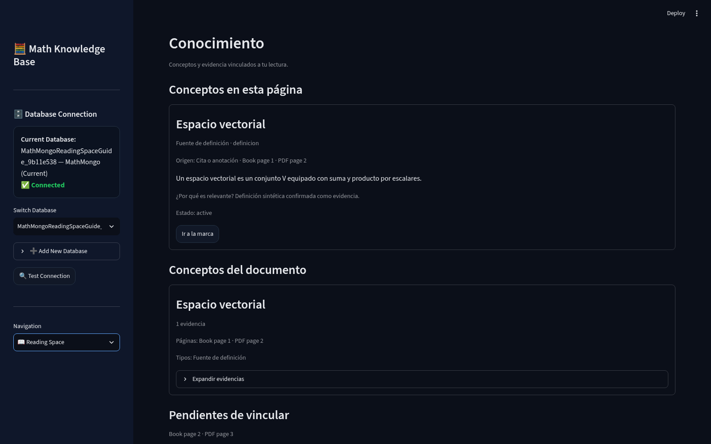

**Qué observar:** `Espacio vectorial` aparece como **Fuente de definición**; el origen es una cita o anotación; se conserva la página lógica y la página PDF; el comentario explica la relevancia.

**Siguiente acción:** expande las evidencias para revisar el registro exacto o usa **Ir a la marca** para regresar al contexto de lectura.

### Tipos de evidence

Elige el tipo que exprese la relación real, por ejemplo:

- fuente de definición;
- fuente de teorema;
- fuente de demostración;
- ejemplo;
- motivación;
- cita;
- pregunta;
- contexto relacionado.

No uses evidence sólo como etiqueta. Incluye un comentario breve que explique por qué la selección respalda o cuestiona el Concept.

## 10. Trabajar en Cuaderno

Hay dos espacios con nombres relacionados:

1. **Reading Space → Cuaderno:** revisión contextual de marcas y Reading Notes del documento seleccionado.
2. **🧪 Cuaderno → Diario:** cuaderno experimental general con notas LaTeX, promoción y otras herramientas de trabajo.

En el Cuaderno de Reading Space, las marcas se agrupan por página y las notas conservan su rango lógico/PDF.

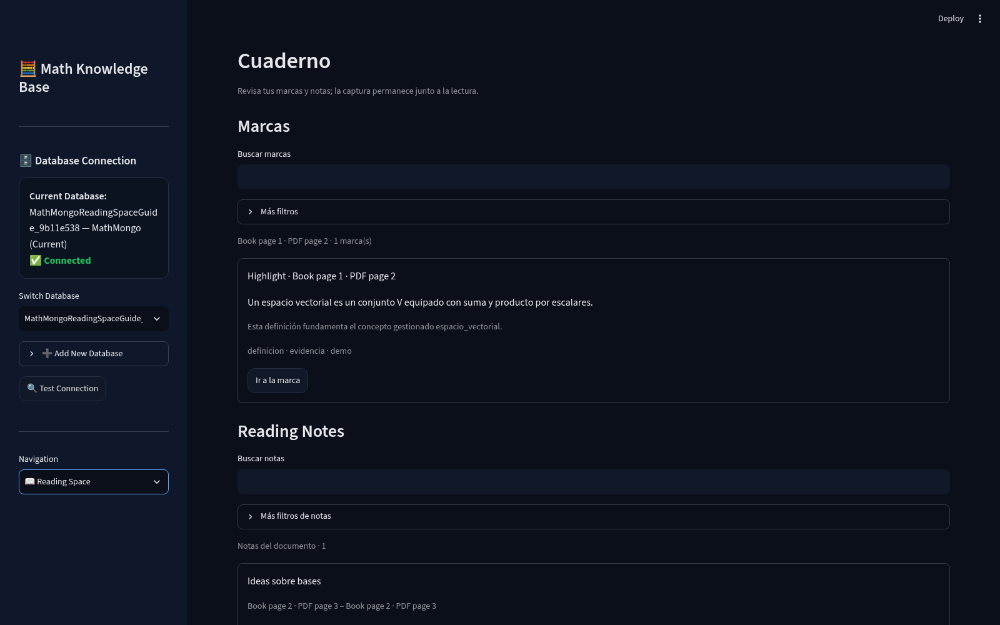

**Qué observar:** la marca conserva cita, comentario y tags; la nota `Ideas sobre bases` conserva el rango de página y aún puede quedar pendiente de asociación.

**Siguiente acción:** usa **Ir a la marca** para revisar el origen o abre **Conocimiento** para enlazar el elemento pendiente con el Concept adecuado.

### Cuándo usar Annotation y cuándo Reading Note

- Usa Annotation para una cita precisa, una pregunta local o una marca rápida.
- Usa Reading Note para una síntesis, idea, definición elaborada, demostración o tarea que abarque más contexto.
- Usa el Diario LaTeX cuando el material todavía está en incubación y puede convertirse después en un Concept independiente.

## 11. Promover desde Cuaderno

Para convertir una nota del Diario LaTeX en conocimiento gestionado:

1. abre **🧪 Cuaderno**;
2. entra en **Diario → Promover**;
3. selecciona la nota;
4. recorta el **Fragmento LaTeX a promover**;
5. asigna un ID nuevo, título y tipo;
6. selecciona una Source gestionada activa;
7. revisa categorías, comentario y metadatos;
8. genera una vista previa si la necesitas;
9. pulsa **Crear concepto desde nota**.

La promoción crea un Concept y su documento LaTeX canónico. La nota original permanece como incubadora y la procedencia se conserva en los metadatos técnicos.

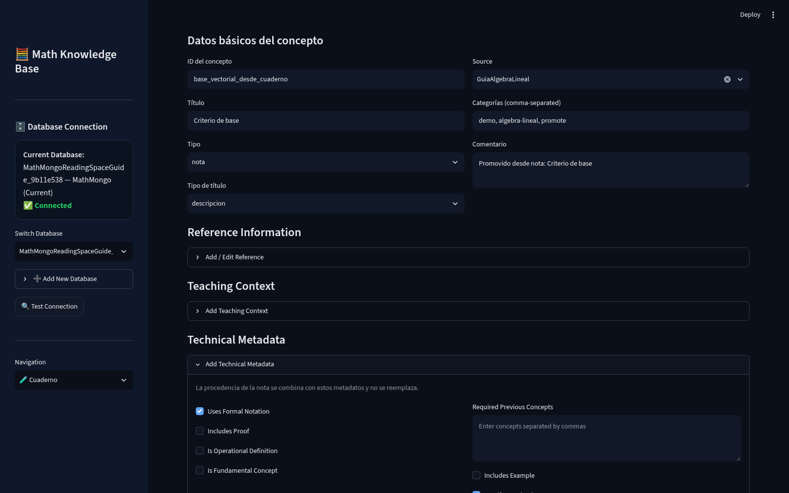

**Qué observar:** el ID nuevo es `base_vectorial_desde_cuaderno`; la Source se elige del catálogo; categorías y comentario conservan el contexto; el panel recuerda que la procedencia no se reemplaza.

**Siguiente acción:** confirma que el ID no exista y que el fragmento sea autocontenido. Ejecuta la promoción una sola vez y luego abre el resultado en **Edit Concept**.

> Promover no implementa automáticamente relaciones sugeridas ni asocia imágenes nuevas al Concept. Haz esas tareas después y de forma explícita.

## 12. Editar conceptos

En **✏️ Edit Concept**, filtra por Source o tipo y selecciona el Concept exacto. En v0.13.0 son inmutables:

- **ID**;
- **Source snapshot**;
- **Managed Source ID** cuando existe;
- el tipo de Concept en esta vista.

Sí puedes editar título, tipo de título, categorías, LaTeX, imágenes, referencia histórica, contexto docente, metadatos técnicos y comentario.

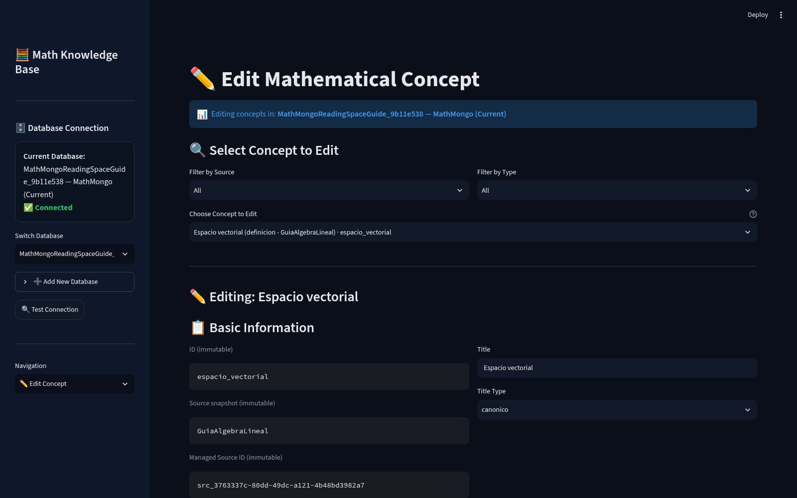

**Qué observar:** `espacio_vectorial`, `GuiaAlgebraLineal` y el `src_<uuid>` aparecen como campos de sólo lectura.

**Siguiente acción:** cambia únicamente el contenido necesario, revisa la vista previa y pulsa **Update Concept**. Usa **Reset to Original** si deseas descartar cambios del formulario.

### Sobre Delete Concept

El botón de eliminación no debe interpretarse como una limpieza integral de todas las dependencias. Antes de usarlo, revisa relaciones, evidence, imágenes, exportaciones y cualquier artefacto derivado. Para reorganizar contenido suele ser más seguro editar o archivar las entidades que lo permiten.

## 13. Conceptos legacy

Un Concept legacy tiene la pareja histórica `id@source`, pero carece de `source_id`. No se vincula automáticamente por similitud de nombre.

### Localizarlo

1. abre **✏️ Edit / Analyze Source**;
2. selecciona la Source gestionada;
3. elige **Concepts — Legacy Read Only**;
4. busca por ID, título o tipo;
5. abre el Concept exacto en **Edit Concept**.

### Enlazarlo a una Source existente

En Edit Concept aparecerá **Link to an existing managed Source**:

1. verifica el ID y el snapshot histórico;
2. selecciona la Source gestionada objetivo;
3. revisa el `source_id` objetivo;
4. activa la confirmación que enumera las tres identidades;
5. pulsa **Link managed Source** una sola vez.

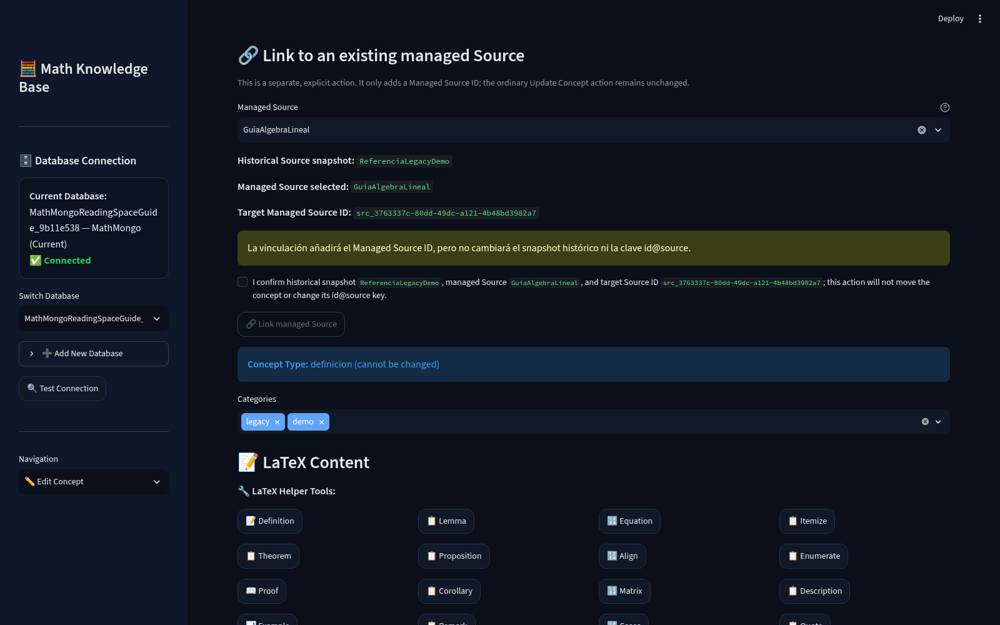

**Qué observar:** el snapshot `ReferenciaLegacyDemo` no cambia; la Source gestionada es `GuiaAlgebraLineal`; el `source_id` objetivo se muestra antes de confirmar; la acción está separada de Update Concept.

**Siguiente acción:** tras enlazar, recarga Edit Concept y comprueba que aparece **Managed Source ID (immutable)**. Verifica también el documento LaTeX de la misma pareja exacta.

El enlace no mueve el Concept, no cambia su `id@source` y no crea una Source nueva. Sólo añade el vínculo estable a una Source activa existente.

## 14. Document Builder y Knowledge Maps

### Document Builder

Document Builder compone una salida modular a partir de Concepts guardados:

1. selecciona la Source;
2. filtra por tipo, título, ID o tags;
3. añade Concepts al documento actual;
4. ordena manualmente o con una estrategia;
5. valida el LaTeX desde MongoDB;
6. corrige errores en los Concepts o aplica sólo los fixes seguros de exportación;
7. genera el documento en una carpeta de salida revisada.

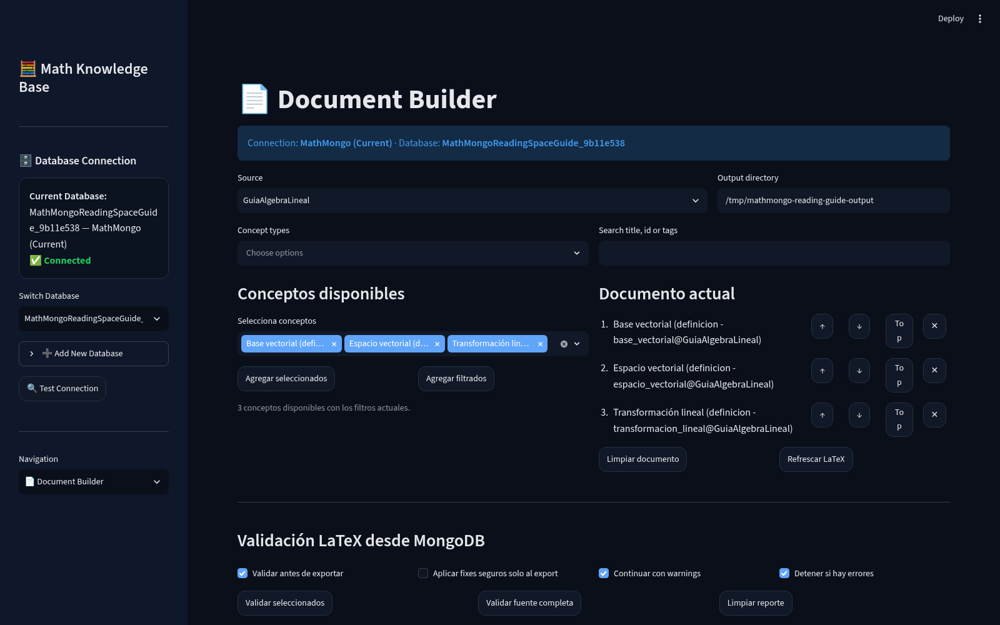

**Qué observar:** la base y la Source aparecen arriba; la carpeta de demostración está en `/tmp`; los tres Concepts muestran la identidad `id@source`; el orden puede cambiarse antes de validar.

**Siguiente acción:** pulsa **Validar seleccionados**. No generes la salida hasta resolver errores y decidir conscientemente cómo tratar warnings.

Document Builder lee el conocimiento existente; no sustituye Edit Concept ni corrige de forma permanente la base cuando se eligen fixes sólo de exportación.

### Knowledge Graph

La página **📊 Knowledge Graph** visualiza Concepts y relaciones. Úsala para:

- comprobar componentes aislados;
- detectar relaciones faltantes;
- explorar dependencias conceptuales;
- validar que las Sources esperadas estén presentes.

Un grafo no reemplaza la evidencia de lectura: una arista conceptual y un evidence link responden preguntas distintas.

### Knowledge Maps

Cuaderno puede guardar mapas de conocimiento con nombre, descripción, filtros, estado del grafo y configuración de sincronización. Los mapas pertenecen a la base activa. Revisa siempre el banner de base antes de crear o sincronizar uno.

### Page Map

El Page Map de Reading Space relaciona páginas PDF con páginas lógicas del libro. No es un Knowledge Map. Configúralo desde Reading Space cuando portada, índice o numeración romana desplacen la página del libro.

## 15. Exportación y respaldo

MathMongo ofrece varias salidas y no todas son un respaldo completo:

| Opción | Uso principal |
|---|---|
| **📤 Export** | Salidas de contenido para otros flujos; revisa qué colecciones incluye. |
| **📦 Database Export** | Archivo de portabilidad de la base seleccionada y sus artefactos compatibles. |
| **📥 Database Import** | Inspección e importación de un archivo a una base destino explícita. |
| Document Builder | Documento compuesto; no es un respaldo de MongoDB. |

### Procedimiento seguro

1. Confirma la base real en dos lugares de la interfaz.
2. Evita escrituras concurrentes durante el export.
3. Abre **Database Export** y revisa el resumen.
4. Guarda el ZIP fuera del repositorio y de carpetas temporales.
5. Conserva fecha, versión de MathMongo, tamaño y checksum.
6. Prueba el archivo en una base nueva y vacía con nombre inequívoco.
7. Verifica Sources, References, Documents, blobs PDF, Concepts, estado de lectura, annotations, notes y evidence.
8. No reemplaces ni borres la base original hasta completar la prueba.

Antes de importar:

- inspecciona el archivo;
- confirma la base destino;
- revisa conflictos de identidades;
- entiende qué elementos serán insertados, idénticos, omitidos o bloqueados;
- conserva el informe de la operación.

Un export correcto no elimina la necesidad de un respaldo administrativo periódico de MongoDB y del almacenamiento de documentos según las políticas de tu entorno.

## 16. Problemas frecuentes

### MongoDB no está activo

**Síntoma:** la tarjeta muestra desconexión o la aplicación no inicia.

**Acción:** inicia el servicio MongoDB según la administración de tu sistema, confirma que responde en la URI configurada y vuelve a lanzar MathMongo. No cambies datos mientras la conexión sea incierta.

### El puerto 8501 está ocupado

**Síntoma:** Streamlit no puede enlazar el puerto.

**Acción:** identifica primero el proceso existente. Si no pertenece a esta ejecución, no lo detengas; usa otro puerto:

```bash
make run DATABASE="NombreExactoDeLaBase" STREAMLIT_PORT=8502 ADVANCED_READER_PORT=8767
```

### No hay Sources activas

**Síntoma:** Add Concept o Promote no permite seleccionar Source.

**Acción:** crea una Source en Add Source o reactiva una Source archivada desde Edit / Analyze Source. Verifica que los índices del catálogo estén listos.

### El PDF no aparece

**Síntoma:** la Source existe, pero Biblioteca está vacía o Advanced Reader no abre.

**Acción:** revisa **Edit / Analyze Source → Documents**. Confirma que el Document está activo, que pertenece a la Source correcta y que **Comprobar integridad** valida el blob. Vuelve a abrir Reading Space después.

### La base visible no es la esperada

**Síntoma:** el perfil parece correcto, pero el banner muestra otra base.

**Acción:** detén el flujo, cambia de conexión o reinicia con `DATABASE` explícito. No confíes en una pestaña antigua del navegador ni en el nombre del perfil por sí solo.

### El Concept es legacy

**Síntoma:** Edit Concept muestra que no está enlazado a una Source gestionada.

**Acción:** verifica la pareja exacta, selecciona una Source activa en el panel de enlace y confirma las tres identidades. No edites `source_id` manualmente.

### No se puede eliminar una Source

**Síntoma:** la eliminación física está bloqueada.

**Acción:** revisa los blockers de References, Documents, Concepts y vínculos futuros. Archiva la Source si sólo necesitas retirarla de los flujos activos. No borres dependencias en cascada sin un plan de respaldo.

### Reading Space pide inicialización

**Síntoma:** las escrituras de lectura están deshabilitadas.

**Acción:** abre los diagnósticos, confirma el nombre exacto de la base y aplica únicamente el plan de índices aprobado para esa base. Si existe un conflicto de índice, detente y revísalo; no lo reemplaces a ciegas.

### Advanced Reader no está listo

**Síntoma:** el botón existe, pero el lector no abre o informa un servicio no disponible.

**Acción:** comprueba que el runtime levantó el puerto configurado de Advanced Reader y que la URL corresponde a la misma ejecución. Reinicia ambos servicios juntos si hay dudas sobre la base enlazada.

## 17. Limitaciones v0.13.0

Ten presentes estas limitaciones antes de operar sobre datos importantes:

1. **Delete Concept no es integral.** No debe asumirse que limpia todas las relaciones, evidence, imágenes, exports o artefactos derivados.
2. **Browse Concepts y algunos flujos Quarto pueden mostrar IDs duplicados o ambiguos.** La identidad segura sigue siendo la pareja exacta `id@source` y, para Sources gestionadas, su `source_id`.
3. **Los diagnósticos de portabilidad de enlaces siguen siendo incompletos.** Después de exportar/importar, verifica manualmente Concepts, documentos, annotations, notes y evidence links.
4. **La eliminación física tiene límites frente a concurrencia.** Un preflight puede quedar desactualizado si otro proceso crea dependencias al mismo tiempo; evita escritores concurrentes y conserva respaldo.
5. **Change Source no está implementado.** Edit Concept no mueve un Concept entre Sources ni cambia su snapshot histórico. El enlace legacy sólo añade `source_id` sin cambiar `id@source`.

Además, las herramientas experimentales de Cuaderno pueden requerir inicialización por base y no todas las sugerencias se convierten automáticamente en relaciones o imágenes del Concept promovido.

## 18. Buenas prácticas

- Confirma la base activa antes de cada operación de escritura.
- Crea primero la Source y después References, Documents y Concepts.
- Usa Sources gestionadas en altas nuevas; reserva el flujo legacy para datos heredados.
- Trata `source_id`, `reference_id`, `document_id` e `id@source` como identidades, no como texto decorativo.
- No inventes metadatos bibliográficos.
- Comprueba la integridad del PDF después de adjuntarlo y tras una importación.
- Define temprano el mapeo entre página PDF y página del libro.
- Escribe annotations breves y Reading Notes desarrolladas.
- Añade a evidence un comentario que explique relevancia y tipo de vínculo.
- Promueve desde Cuaderno sólo fragmentos maduros y con un ID nuevo.
- Corrige el Concept fuente cuando Document Builder detecte un error real.
- Archiva antes de considerar eliminación física.
- Evita importaciones, enlaces y borrados con escritores concurrentes.
- Prueba periódicamente los respaldos en una base nueva.
- Conserva la versión de MathMongo junto a cada export importante.

### Documentación relacionada

- [Managed Source Workflow](../MANAGED_SOURCE_WORKFLOW.md)
- [Release Notes v0.13.0 — Managed Source Workflow](../RELEASE_NOTES_v0.13.0_MANAGED_SOURCE_WORKFLOW.md)
- [Version Closure — Managed Source Workflow](../VERSION_CLOSURE_MANAGED_SOURCE_WORKFLOW.md)

Con este flujo, Reading Space funciona como el puente entre lectura, evidencia y conocimiento reutilizable, sin perder la identidad histórica ni la Source gestionada que da contexto a cada Concept.
